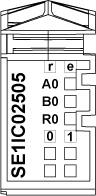

# Status LEDs

Status LEDs

The following illustration shows the [LEDs](../glossary/glossary.htm#XREF_D_SE_0024697_302) for TM5SE1IC02505:

The table below shows the TM5SE1IC02505 status LEDs:

| LEDs | Color | Status | Description |
| --- | --- | --- | --- |
| r | Green | Off | No power supply |
| Single Flash | Reset state |
| Flashing | Preoperational state |
| On | Normal operation |
| e | Red | Off | OK or no power supply |
| On | Detected error or reset state |
| A0 | Green | On | Input state of counter input A |
| B0 | Green | On | Input state of counter input B |
| R0 | Green | On | Input state of reference pulse R |
| 0-1 | Green | On | Input state of the digital inputs |