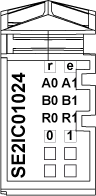

# Status LEDs

Status LEDs

The following illustration shows the LEDs for TM5SE2IC01024:

The table below shows the TM5SE2IC01024 status LEDs:

| LEDs | Color | Status | Description |
| --- | --- | --- | --- |
| r | Green | Off | No power supply |
| Single Flash | Reset state |
| Flashing | Preoperational state |
| On | Normal operation |
| e | Red | Off | OK or no power supply |
| On | Detected error or reset state |
| A0, A1 | Green | On | Input state of counter input A0 or A1 |
| B0, B1 | Green | On | Input state of counter input B0 or B1 |
| R0, R1 | Green | On | Input state of reference pulse R0 or R1 |
| 0-1 | Green | On | Input state of the corresponding digital inputs |