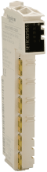

# TM5 Expert (High Speed Counter) Modules - Hardware Guide

TM5 Expert (High Speed Counter) Modules - Hardware Guide

TM5 Expert (High Speed Counter) Modules - Hardware Guide

This manual describes the hardware implementation of the Modicon TM5 expert modules. It provides parts descriptions, specifications, wiring diagrams, installation and setup for Modicon TM5 expert modules.

EIO0000003209.01

© 2020 Schneider Electric. All rights reserved.