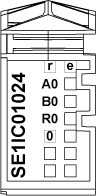

# TM5SE1IC01024 Presentation

TM5SE1IC01024 Presentation

Main Characteristics

The table below describes the main characteristics of the TM5SE1IC01024 electronic module:

| Main Characteristics | | |
| --- | --- | --- |
| Number of input channels | 1 | |
| Encoder type | Incremental | |
| Input frequency | 100 kHz | |
| Encoder supply | 24 Vdc | |
| Encoder input | 24 Vdc asymmetrical | |
| Additional input | 1 | |
| Resolution | 16/32 bits | |

Ordering Information

The following illustration shows the slice with a TM5SE1IC01024:

The table below shows the model numbers for the terminal block and bus base associated with the TM5SE1IC01024:

| Number | Model Number | Description | Color |
| --- | --- | --- | --- |
| 1 | TM5ACBM11  or  TM5ACBM15 | Bus base    Bus base with address setting | White    White |
| 2 | TM5SE1IC01024 | Electronic module | White |
| 3 | TM5ACTB12 | Terminal block, 12 pins | White |

NOTE: For more information, refer to [TM5 bus bases and terminal blocks](../../../../../../api/crossBook?lang=en-US&virtualBookName=m258pig&topicID=D_SE_0004365_1)

Status LEDs

The following illustration shows the LEDs for TM5SE1IC01024:

The table below shows the TM5SE1IC01024 status LEDs:

| LEDs | Color | Status | Description |
| --- | --- | --- | --- |
| r | Green | Off | No power supply |
| Single Flash | Reset state |
| Flashing | Preoperational state |
| On | Normal operation |
| e | Red | Off | OK or no power supply |
| On | Detected error or reset state |
| A0 | Green | On | Input state of counter input A |
| B0 | Green | On | Input state of counter input B |
| R0 | Green | On | Input state of reference pulse R |
| 0 | Green | On | Input state of the digital input |

EIO0000003209.01

© 2020 Schneider Electric. All rights reserved.