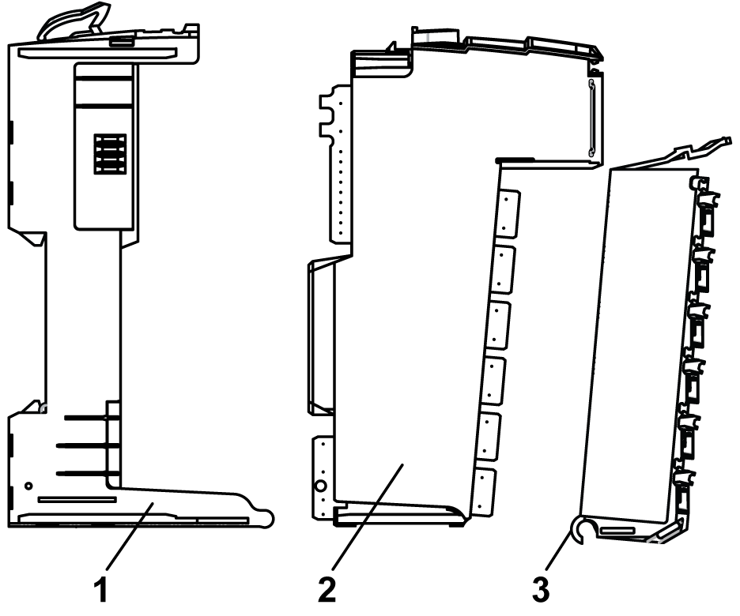

# Physical Description

Physical Description

Introduction

Each slice consists of three [elements](../glossary/glossary.htm#XREF_D_SE_0024697_725). These elements are the bus base, the electronic module and the [terminal block](../glossary/glossary.htm#XREF_D_SE_0024697_420).

Elements

The following illustration shows the elements of a slice.

1   Bus base

2   Electronic module

3   Terminal block

When assembled the three components form an integral unit that resists vibration and electrostatic discharge.

|  |
| --- |
| NOTICE |
| ELECTROSTATIC DISCHARGE |
| oNever touch the contacts of the electronic module.  oAlways keep the connector in place during normal operation. |
| Failure to follow these instructions can result in equipment damage. |

Dimensions

The following illustration shows the dimensions of a slice:

Pin Assignment

The following illustration shows the pin assignments respectively for the 6-pin, 12-pin and the 16-pin terminal blocks:

Accessories

Refer to the [Installation of Accessories](../../../../../../api/crossBook?lang=en-US&virtualBookName=pacdpig&topicID=D_SE_0001024_1).

Labeling

Refer to the [Labeling the TM5 System](../../../../../../api/crossBook?lang=en-US&virtualBookName=pacdpig&topicID=D_SE_0001023_1).

EIO0000002724.02

© 2018 Schneider Electric. All rights reserved.