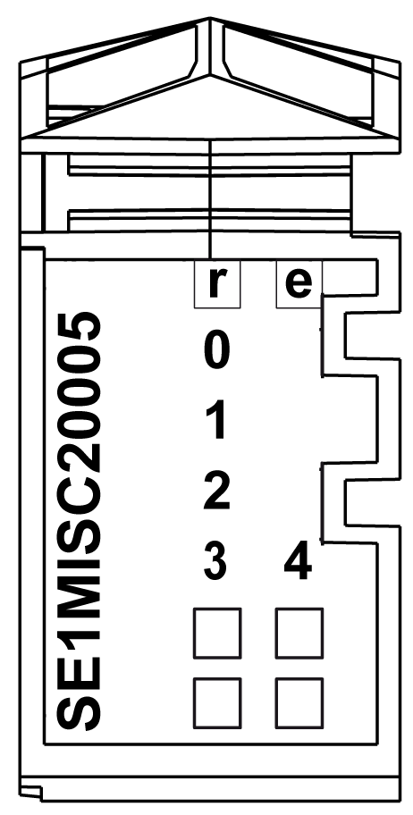

# TM5SE1MISC20005 Presentation

TM5SE1MISC20005 Presentation

Overview

The digital signal processor module TM5SE1MISC20005 is used for encoder emulation, frequency inverters, or servo axes with the speed follow function can follow a real or virtual master axis.

The TM5SE1MISC20005 module provides the following features:

o3 digital 5 V channels, configurable as inputs or outputs

o2 digital 24 V input channels

oEncoder evaluation (A/B) with one reference pulse

Main Characteristics

The following table describes the main characteristics of the digital signal processor module TM5SE1MISC20005:

| Main characteristics | |
| --- | --- |
| Number of digital inputs | 2 |
| Number of input channels | 1 |
| Encoder type | Incremental |
| Output counting frequency | maximum 4 MHz using 4 x evaluation |
| Encoder supply | 24 Vdc |
| Encoder output | 5 V symmetrical |
| Counter functions | Encoder emulation (A/B) with one reference pulse |
| Resolution | 16/32-bit |

Ordering Information

The illustration below shows the TM5SE1MISC20005:

The following table shows the references for the terminal block and the bus bases associated with the TM5SE1MISC20005:

| Number | Reference | Description | Color |
| --- | --- | --- | --- |
| 1 | TM5ACBM11  or  TM5ACBM15 | Bus base    Bus base with address setting | White    White |
| 2 | TM5SE1MISC20005 | Electronic module | White |
| 3 | TM5ACTB12 | Terminal block, 12 pins | White |

NOTE: For more information, refer to [TM5 bus bases and terminal blocks](../../../../../../api/crossBook?lang=en-US&virtualBookName=pacdpig&topicID=D_SE_0004365_1).

Status LEDs

The following illustration describes the LEDs for TM5SE1MISC20005:

The table shows the TM5SE1MISC20005 status LEDs:

| LED | Color | Status | Description |
| --- | --- | --- | --- |
| r | Green | Off | No power supply |
| Single flash | Reset state |
| Double flash | Boot state (during firmware update)  Depending on the configuration, a firmware update can take up to several minutes. |
| Flashing | Preoperational state |
| On | Normal operation |
| e | Red | Off | OK or no power supply |
| On | Error detected or reset state |
| Single flash | Input / output error detected. |
| Double flash | System error detected. |
| Triple flash | I/O error and system error occur together. |
| 0-4 | Green | On | Status of the corresponding digital signal. |

EIO0000002724.02

© 2018 Schneider Electric. All rights reserved.