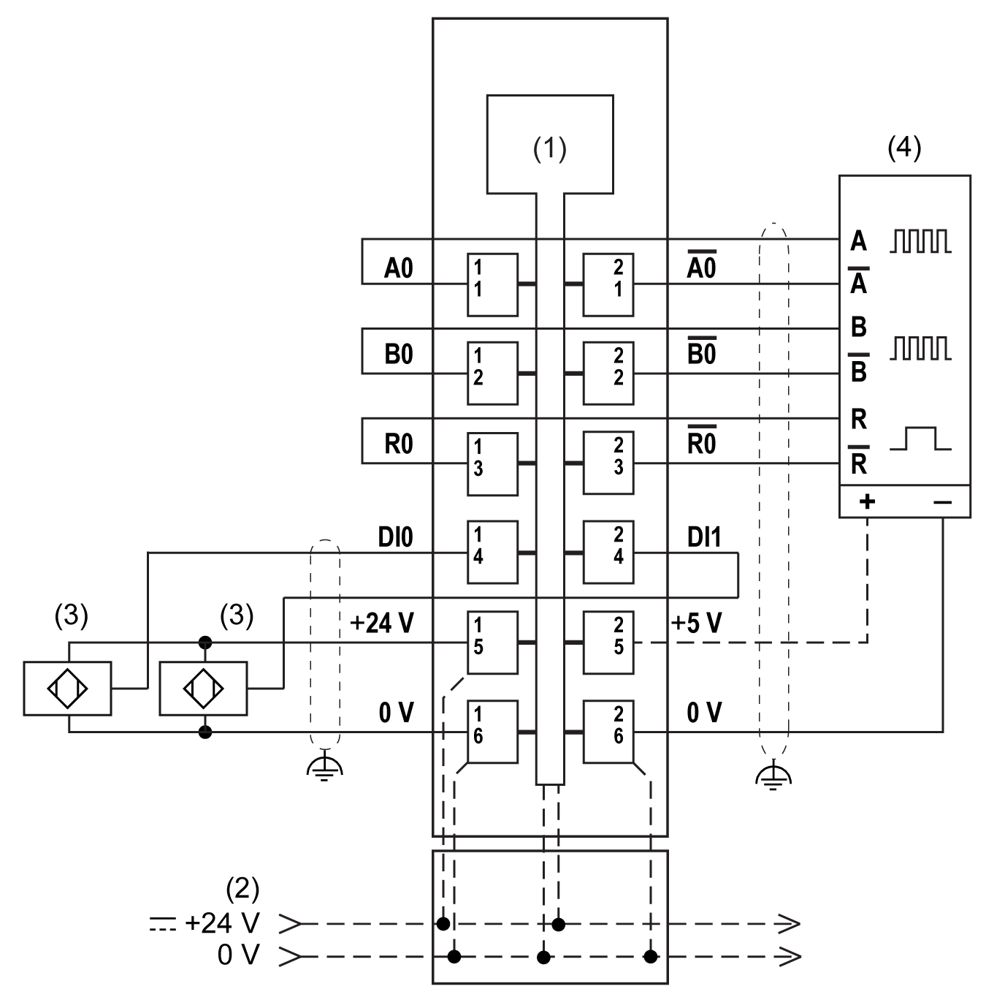

# TM5SE1MISC20005 Wiring Diagram

TM5SE1MISC20005 Wiring Diagram

Wiring Diagram

The following illustration presents the wiring diagram for the TM5SE1MISC20005:

1   Internal electronics

2   24 Vdc I/O power segment integrated into bus base

3   3-wire sensor

4   Encoder input

|  |
| --- |
| Warning_Color.gifWARNING |
| UNINTENDED EQUIPMENT OPERATION |
| Use the sensor and actuator power supply only for supplying power to sensors or actuators connected to the module. |
| Failure to follow these instructions can result in death, serious injury, or equipment damage. |

Use shielded, properly grounded cables for all analog and high-speed inputs or outputs and communication connections. If you do not use shielded cable for these connections, electromagnetic interference can cause signal degradation. Degraded signals can cause the controller or attached modules and equipment to perform in an unintended manner.

|  |
| --- |
| Warning_Color.gifWARNING |
| UNINTENDED EQUIPMENT OPERATION |
| oUse shielded cables for all fast I/O, analog I/O and communication signals.  oGround cable shields for all analog I/O, fast I/O and communication signals at a single point1.  oRoute communication and I/O cables separately from power cables. |
| Failure to follow these instructions can result in death, serious injury, or equipment damage. |

1Multipoint grounding is permissible if connections are made to an equipotential ground plane dimensioned to help avoid cable shield damage in the event of power system short-circuit currents.

|  |
| --- |
| Warning_Color.gifWARNING |
| UNINTENDED EQUIPMENT OPERATION |
| Do not connect wires to unused terminals and/or terminals indicated as “No Connection (N.C.)”. |
| Failure to follow these instructions can result in death, serious injury, or equipment damage. |

EIO0000002724.02

© 2018 Schneider Electric. All rights reserved.