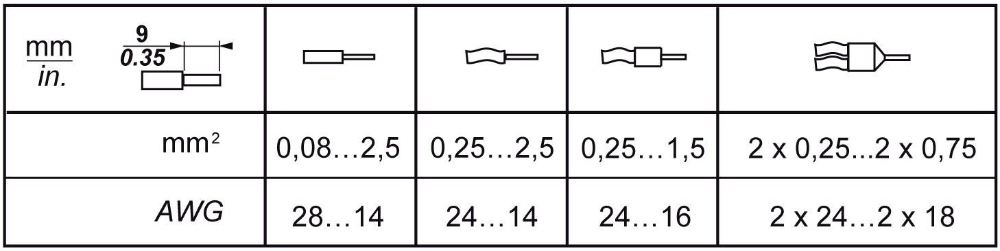
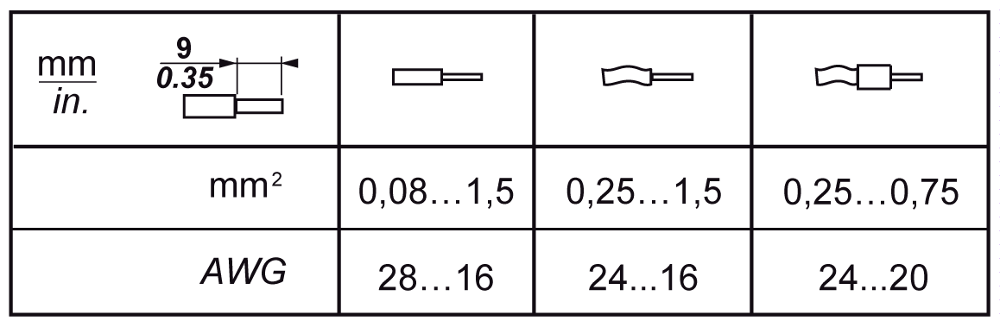

# Wiring Rules

Wiring Rules

|  |
| --- |
| DangerElectrical_Color.gifDanger_Color.gifDANGER |
| HAZARD OF ELECTRIC SHOCK, EXPLOSION OR ARC FLASH |
| oDisconnect all power from all equipment including connected devices prior to removing any covers or doors, or installing or removing any accessories, hardware, cables, or wires except under the specific conditions specified in the appropriate hardware guide for this equipment.  oAlways use a properly rated voltage sensing device to confirm the power is off where and when indicated.  oReplace and secure all covers, accessories, hardware, cables, and wires and confirm that a proper ground connection exists before applying power to the unit.  oUse only the specified voltage when operating this equipment and any associated products. |
| Failure to follow these instructions will result in death or serious injury. |

The following rules must be applied when wiring the TM5 System:

oI/O and communication wiring must be kept separate from the power wiring. Route these 2 types of wiring in separate cable ducting.

oVerify that the operating conditions and environment are within the specification values.

oUse proper wire sizes to meet voltage and current requirements.

oUse copper conductors only.

oUse twisted pair, shielded cables for analog, expert, or [fast I/O](../glossary/glossary.htm#XREF_D_SE_0024697_699) and TM5 bus signals.

oUse twisted pair, shielded cables for [encoder](../glossary/glossary.htm#XREF_D_SE_0024697_689), [network](../glossary/glossary.htm#XREF_D_SE_0024697_152)s and fieldbus ([CAN](../glossary/glossary.htm#XREF_D_SE_0024697_648), serial, [Ethernet](../glossary/glossary.htm#XREF_D_SE_0024697_693)).

Use shielded, properly grounded cables for all analog and high-speed inputs or outputs and communication connections. If you do not use shielded cable for these connections, electromagnetic interference can cause signal degradation. Degraded signals can cause the controller or attached modules and equipment to perform in an unintended manner.

|  |
| --- |
| Warning_Color.gifWARNING |
| UNINTENDED EQUIPMENT OPERATION |
| oUse shielded cables for all fast I/O, analog I/O and communication signals.  oGround cable shields for all analog I/O, fast I/O and communication signals at a single point1.  oRoute communication and I/O cables separately from power cables. |
| Failure to follow these instructions can result in death, serious injury, or equipment damage. |

1Multipoint grounding is permissible if connections are made to an equipotential ground plane dimensioned to help avoid cable shield damage in the event of power system short-circuit currents.

Refer to the section Grounding the TM5 System to ground the shielded cables.

This table provides the wire sizes to use with the removable spring [terminal blocks](../glossary/glossary.htm#XREF_D_SE_0024697_420) (TM5ACTB06, TM5ACTB12, TM5ACTB12, TM5ACTB12PS, TM5ACTB32):

This table provides the wire sizes to use with the TM5ACTB16 terminal blocks:

|  |
| --- |
| Danger_Color.gifDANGER |
| FIRE HAZARD |
| Use only the correct wire sizes for the maximum current capacity of the I/O channels and power supplies. |
| Failure to follow these instructions will result in death or serious injury. |

The spring clamp connectors of the terminal block are designed for only one wire or one cable end. Two wires to the same connector must be installed with a double wire cable end to help prevent loosening.

|  |
| --- |
| DangerElectrical_Color.gifDanger_Color.gifDANGER |
| LOOSE WIRING CAUSES ELECTRIC SHOCK |
| Do not insert more than one wire per connector of the spring terminal blocks unless using a double wire cable end (ferrule). |
| Failure to follow these instructions will result in death or serious injury. |