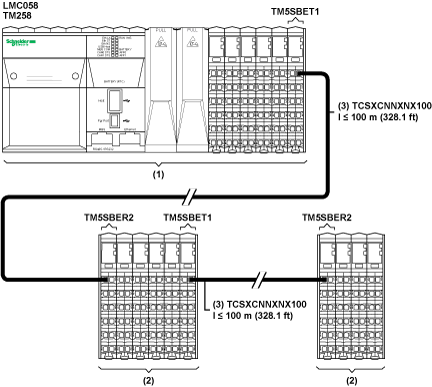

# Implementation of TM5 Transmitter and Receiver Electronic Modules

Implementation of TM5 Transmitter and Receiver Electronic Modules

The maximum distance between a Transmitter and a Receiver is 100 m (328.1 ft). The maximum overall distance between the beginning of the local [configuration](../glossary/glossary.htm#XREF_D_SE_0024697_659) containing a Transmitter and the end of the last remote configuration containing a Receiver is 2500 m (8202.1 ft). The TM5 twisted-pair cable (TCSXCNNXNX100) is required to obtain the maximum distance, the proper electromagnetic resistance and performance required for the communication between Transmitter and Receiver. In addition, the cable must be properly grounded to the functional ground (FE) of your TM5 System.

The following picture presents the TM5 System divided into a local configuration and remote configuration:

(1)   Local Configuration

(2)   Remote I/O Island Configurations

(3)   Expansion bus cable TCSXCNNXNX100

NOTE: For more information to configure Transmitter and Receiver electronic modules refer to [Modicon TM5 Expansion Modules Configuration Programming Guide](../../../../../../api/crossBook?lang=en-US&virtualBookName=tm5prg&topicID=D_SE_0005870_1).