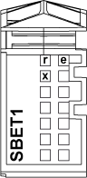

# Status LEDs

Status LEDs

The following figure shows the status [LEDs](../glossary/glossary.htm#XREF_D_SE_0024697_302) for TM5SBET1:

The table describes the TM5SBET1 status LEDs:

| LED | Color | Status | Description |
| --- | --- | --- | --- |
| r | Green | Off | No power supply |
| Single flash | Reset state |
| Flashing | Preoperational state |
| On | Normal state |
| e | Red | Off | OK or no power supply |
| Double flash | Indicates one of the following conditions:  oVoltage from the 24 Vdc I/O power segment is too low  oVoltage for the TM5 power bus is too low |
| e+r | Steady red / single green flash | | Invalid [firmware](../glossary/glossary.htm#XREF_D_SE_0024697_707) |
| X | Yellow | Off | No communication on the TM5 data bus |
| On | TM5 data bus communication in progress |