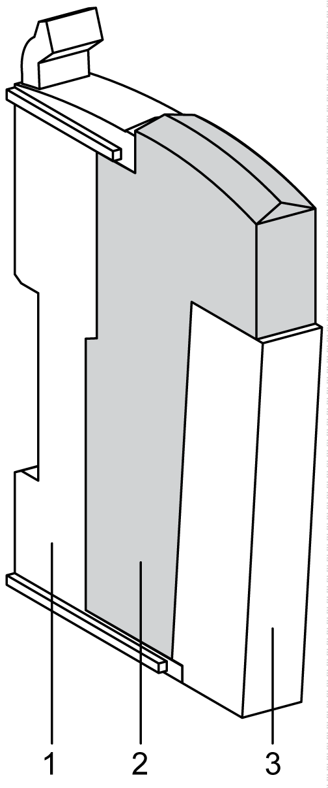

# Ordering Information

Ordering Information

The following figure and table give the references to create a slice with the TM5SBER2 electronic module:

|  |
| --- |
| NOTICE |
| ELECTROSTATIC DISCHARGE |
| oInstall a right bus base locking plate to the rightmost slice of all configurations.  oInstall a left bus base locking plate to the first slice of all remote configurations. |
| Failure to follow these instructions can result in equipment damage. |

| Number | Model Number | Description | Color |
| --- | --- | --- | --- |
| 1 | TM5ACBM01R  or  TM5ACBM05R | Bus base    Bus base with address setting | Gray    Gray |
| 2 | TM5SBER2 | Electronic module | Gray |
| 3 | TM5ACTB12PS | Terminal block, 12-pins | Gray |

NOTE: For more information, refer to [TM5 bus bases and terminal blocks](../../../../../../api/crossBook?lang=en-US&virtualBookName=m258pig&topicID=D_SE_0004365_1).