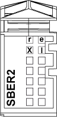

# Status LEDs

Status LEDs

The following figure shows the status LEDs for TM5SBER2:

The table below describes the TM5SBER2 status LEDs:

| LED | Color | Status | Description |
| --- | --- | --- | --- |
| r | Green | Off | No power supply |
| Single Flash | Reset state |
| Flashing | Preoperational state |
| On | Run state |
| e | Red | Off | OK or no power supply |
| Double flash | Indicates one of the following conditions:  oTM5 power bus current is too high (overload)  oVoltage for the 24 Vdc I/O power segment is too low  oVoltage for the TM5 power bus is too low |
| e+r | Steady red / single green flash | | Invalid firmware |
| X | Yellow | Off | No communication on the TM5 data bus |
| On | TM5 data bus communication in progress |
| l | Red | Off | TM5 power bus in the acceptable range |
| On | TM5 power bus current is too high (overload) |