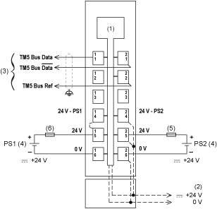

# Wiring Diagram

Wiring Diagram

The following figure shows the wiring diagram for the TM5SBER2:

(1)   Internal electronics

(2)   24 Vdc I/O power segment integrated into the bus bases

(3)   TM5 expansion bus cable (TCSXCNNXNX100)

(4)   PS1/PS2: External isolated power supply 24 Vdc

(5)   External fuse, Type T slow-blow: 10 A max., 250 V

(6)   External fuse, Type T slow-blow: 1 A, 250 V

|  |
| --- |
| Warning_Color.gifWARNING |
| UNINTENDED EQUIPMENT OPERATION |
| Properly ground the cable shields as indicated in the related documentation. |
| Failure to follow these instructions can result in death, serious injury, or equipment damage. |

|  |
| --- |
| Warning_Color.gifWARNING |
| UNINTENDED EQUIPMENT OPERATION |
| Do not connect wires to unused terminals and/or terminals indicated as “No Connection (N.C.)”. |
| Failure to follow these instructions can result in death, serious injury, or equipment damage. |