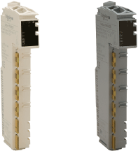

# TM5 Transmitter and Receiver Modules - Hardware Guide

TM5 Transmitter and Receiver Modules - Hardware Guide

TM5 Transmitter and Receiver Modules - Hardware Guide

This manual describes the hardware implementation of the Modicon TM5 Transmitter and Receiver modules. It provides parts descriptions, specifications, wiring diagrams, installation and setup for Modicon TM5 Transmitter and Receiver modules.

EIO0000003215.01

© 2020 Schneider Electric. All rights reserved.