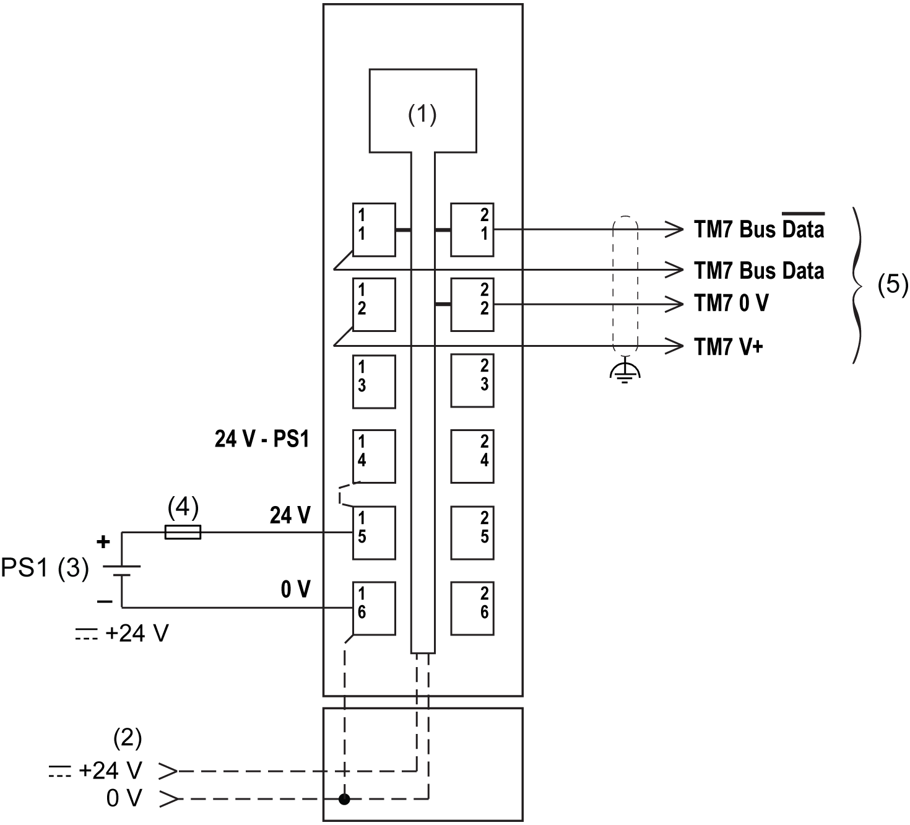

# TM5SBET7 Wiring Diagram

TM5SBET7 Wiring Diagram

Wiring Diagram

The following figure shows the wiring diagram for the TM5SBET7:

(1)   Internal electronics

(2)   24 Vdc I/O power segment integrated into the bus bases

(3)   PS1/PS2: External isolated power supply 24 Vdc

(4)   External fuse, Type T slow-blow: 1 A max., 250 V

(5)   TM7 Expansion bus cable (TCSXCN•FNX••E)

|  |
| --- |
| Warning_Color.gifWARNING |
| UNINTENDED EQUIPMENT OPERATION |
| Properly ground the cable shields as indicated in the related documentation. |
| Failure to follow these instructions can result in death, serious injury, or equipment damage. |

|  |
| --- |
| Warning_Color.gifWARNING |
| UNINTENDED EQUIPMENT OPERATION |
| Do not connect wires to unused terminals and/or terminals indicated as “No Connection (N.C.)”. |
| Failure to follow these instructions can result in death, serious injury, or equipment damage. |

EIO0000003215.01

© 2020 Schneider Electric. All rights reserved.