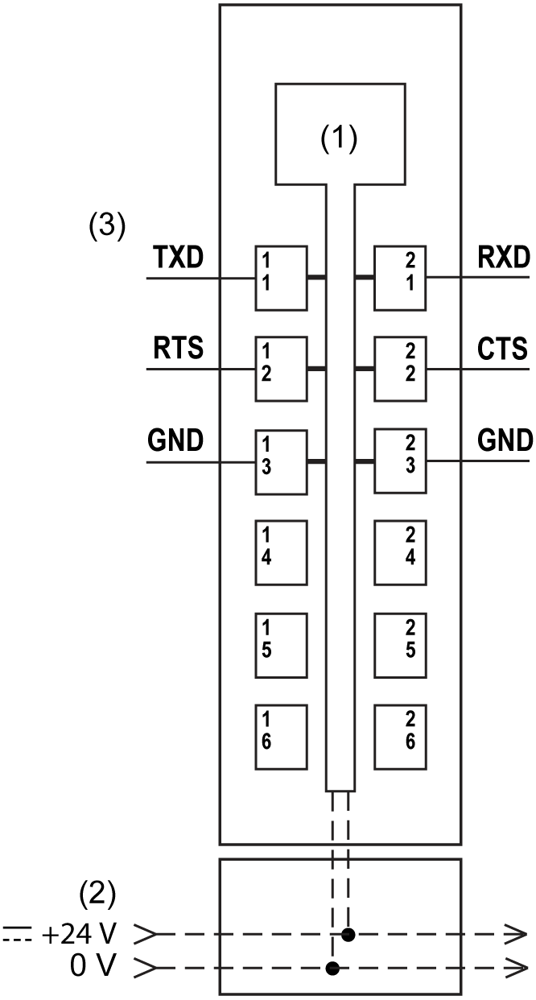

# TM5SE1RS2 Wiring Diagram

TM5SE1RS2 Wiring Diagram

Wiring Diagram

The following illustration shows the wiring diagram for the TM5SE1RS2:

(1)   Internal electronics

(2)   24 Vdc I/O power segment integrated into the bus bases

(3)   1 x RS-232 interface, max. 115.2 kBit/s

TXD   Transmit Data

RTS   Request to Send

RXD   Receive Data

CTS   Clear to Send

GND   Ground

|  |
| --- |
| Warning_Color.gifWARNING |
| UNINTENDED EQUIPMENT OPERATION |
| oUse appropriate safety interlocks where personnel and/or equipment hazards exist.  oInstall and operate this equipment in an enclosure appropriately rated for its intended environment and secured by a keyed or tooled locking mechanism.  oUse the sensor and actuator power supplies only for supplying power to the sensors or actuators connected to the module.  oPower line and output circuits must be wired and fused in compliance with local and national regulatory requirements for the rated current and voltage of the particular equipment.  oDo not use this equipment in safety-critical machine functions unless the equipment is otherwise designated as functional safety equipment and conforming to applicable regulations and standards.  oDo not disassemble, repair, or modify this equipment.  oDo not connect any wiring to reserved, unused connections, or to connections designated as No Connection (N.C.). |
| Failure to follow these instructions can result in death, serious injury, or equipment damage. |

|  |
| --- |
| Warning_Color.gifWARNING |
| UNINTENDED EQUIPMENT OPERATION |
| Properly ground the cable shields as indicated in the related documentation. |
| Failure to follow these instructions can result in death, serious injury, or equipment damage. |

EIO0000003227.01

© 2020 Schneider Electric. All rights reserved.