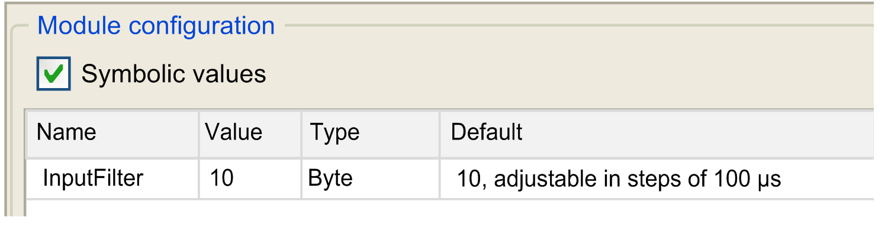
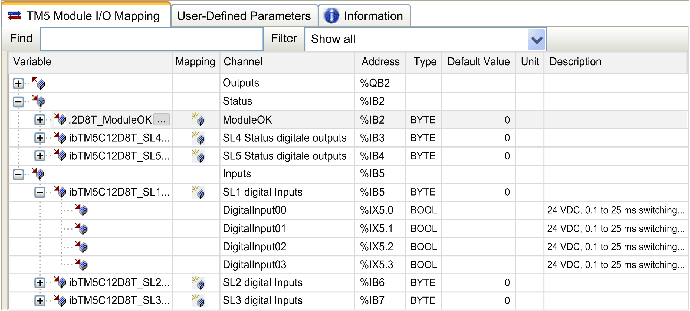

# Adding an Expansion Module

## Procedure

To add an expansion module to your controller or fieldbus interface, select the expansion module in the Hardware Catalog, drag it to the Devices tree, and drop it on one of the highlighted nodes.

## I/O Configuration

To configure the expansion module, double-click the expansion module you added in the Devices tree.

**Result**: The TM5 Module I/O Mapping window is displayed.

## User-Defined Parameters Tab Description

Set the parameters of the expansion module using the User-Defined Parameters tab:

The User-Defined Parameters tab contains these columns:

| Column | Description | Editable |
| --- | --- | --- |
| Name | Parameter name | No |
| Value | Value of the parameter | Yes. An edit frame can be opened by double-clicking. |
| Type | Parameter data type | No |
| Default | Default parameter value | No |

## TM5 Module I/O Mapping Tab Description

Variables can be defined and named in the TM5 Module I/O Mapping tab. Additional information such as topological addressing is also provided in this tab:

The TM5 Module I/O Mapping tab contains these columns:

| Column | Description |
| --- | --- |
| Variable | Lets you map the channel on a variable.  Double-click the variable icon to enter the variable name.  If it is a new variable, the variable is created.  It is also possible to map an existing variable with the variables **Input Assistant** by clicking the input assistant button. |
| Mapping | Indicates if the channel is mapped on a new variable or an existing variable. |
| Channel | Name of the channel of the device. |
| Address | Address of the channel. |
| Type | Data type of the channel. |
| Unit | Unit of the channel value. |
| Description | Description of the channel. |

The parameter Always update variables is set to Enabled 1 (use bus cycle task if not used in any task) and is not editable.

NOTE: %I value is updated from physical information at the beginning of each task using the %I.

Physical output level is updated from memory variable for the outputs value within the task configured by Bus cycle task configuration.

EIO0000003707.04