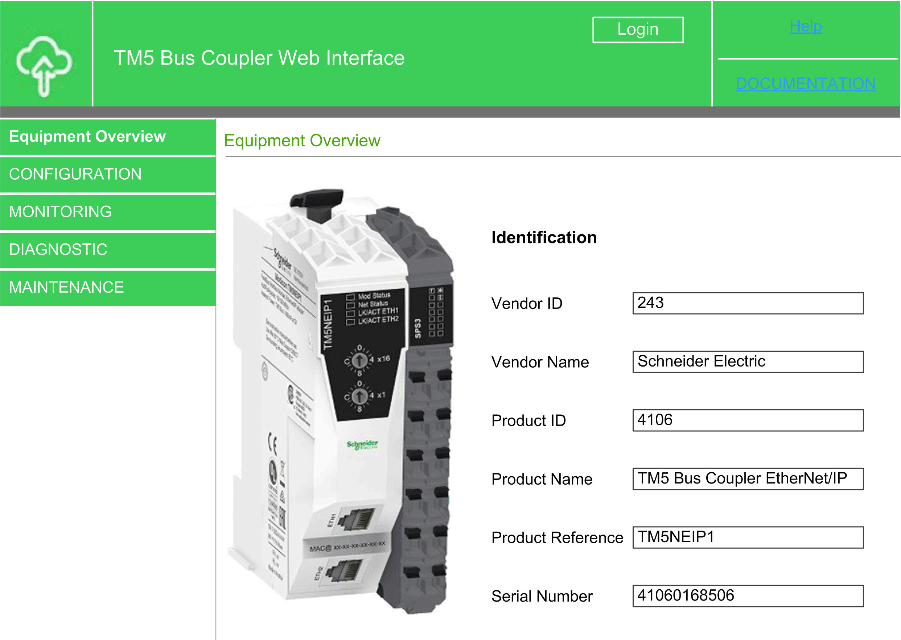
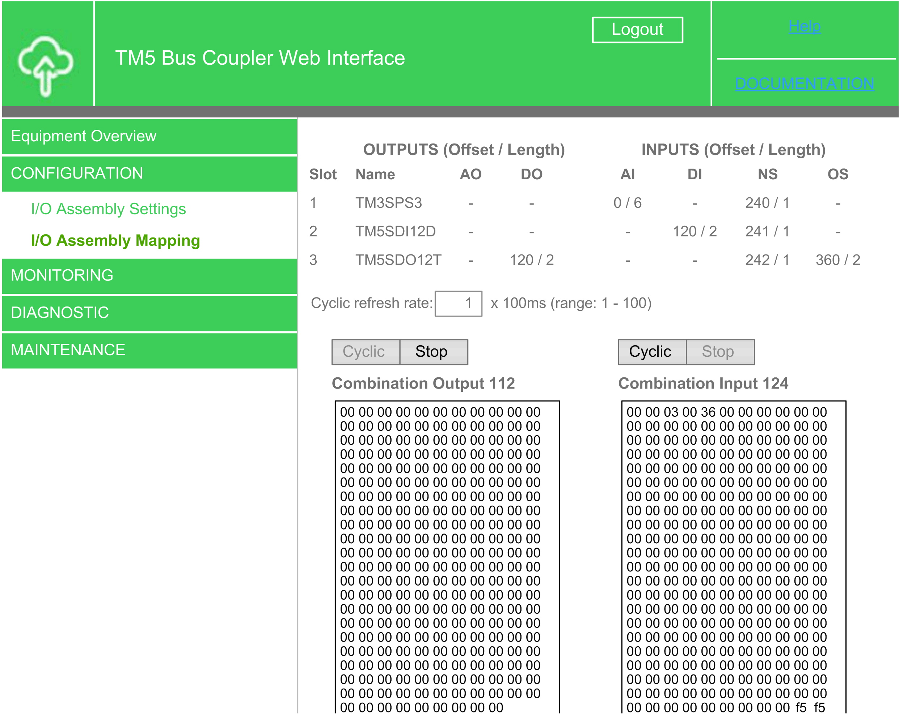
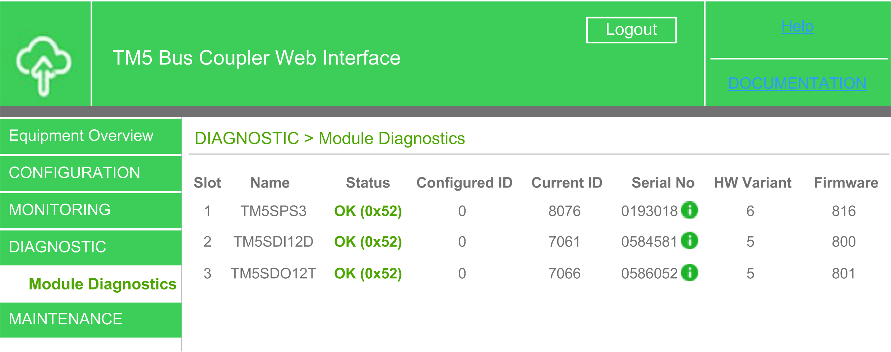
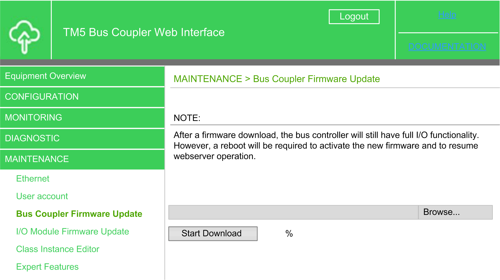
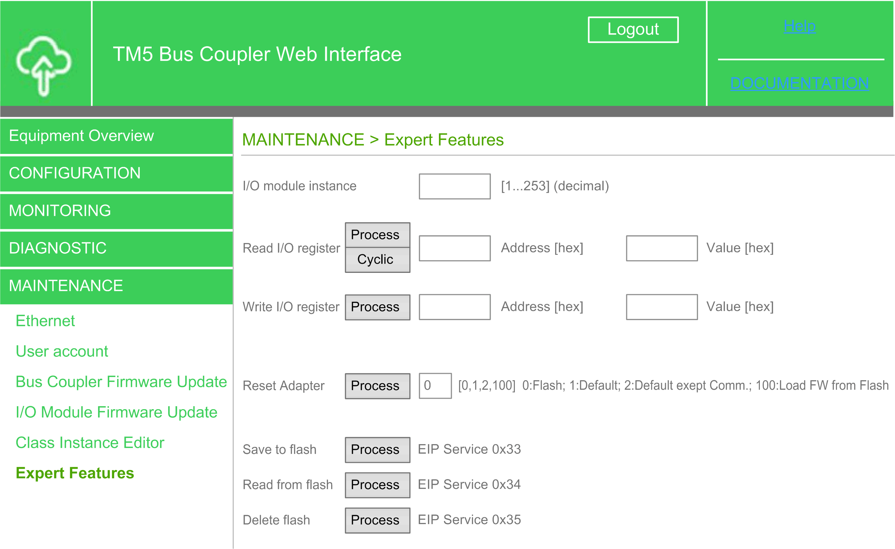

# Web Server

## Introduction

The TM5 EtherNet/IP Fieldbus Interface provides as a standard equipment an embedded Web server with a predefined factory built-in website. You can use the pages of the website for module setup and as well as application diagnostics and monitoring. These pages are ready for use with a Web browser. No configuration or programming is required.

The Web server can be accessed by the web browsers listed below:

* Google Chrome (version 65.0 or greater)
* Mozilla Firefox (version 54 or greater)
* Microsoft Internet Explorer (version 11 or greater)

The Web server is limited to 32 concurrent connections.

The Web server is a tool for reading data, writing data and controlling the state of the TM5 EtherNet/IP Fieldbus Interface with full access to all data in you application. In case of security concerns over these functions you must, at least, assign a secure password to the Web server to prevent unauthorized access to the application.

The Web server allows you to monitor a TM5 EtherNet/IP Fieldbus Interface remotely to perform various maintenance activities including modifications to data, configuration parameters and modifications of the TM5 EtherNet/IP Fieldbus Interface state. Care must be taken to ensure that the immediate physical environment of the machine and process is in a state that will not present safety risks to people or property before executing control remotely.

| WARNING | |
| --- | --- |
|  | UNINTENDED EQUIPMENT OPERATION  * Define a secure password for the Web server, and do not allow unauthorized or otherwise unqualified personnel to use this feature. * Ensure that there is a local, competent, and qualified observer present when operating on the controller from a remote location. * You must have a complete understanding of the application and the machine/process it is controlling before attempting to adjust data, stopping an application that is operating, or starting the controller remotely. * Take the precautions necessary to assure that you are operating on the intended controller by having clear, identifying documentation within the controller application and its remote connection.  Failure to follow these instructions can result in death, serious injury, or equipment damage. |

NOTE: The Web server must only be used by authorized and qualified personnel. A qualified person is one who has the skills and knowledge related to the construction and operation of the machine and the process controlled by the application and its installation, and has received safety training to recognize and avoid the hazards involved.

## Web Server Access

The Web server is a service that allows you to remotely monitor the device and its configuration parameters.

NOTE: The Web server is disabled by default. The Web server can be enabled or disabled through the EcoStruxure Machine Expert software. For more details, refer to [Configuration Stream Tab](D-SE-0092113.html#D-SE-0092113__ConfigurationStreamTab-6E645F1A).

When logging in to Web server for the first time, the default username (admin) and the default password (TM5NEIP1) must be used, and then the user is requested to change the password.

All other Web server menus remain unavailable until the password has been changed.

| WARNING | |
| --- | --- |
|  | UNAUTHORIZED DATA ACCESS  Disable the Web server to prevent any unwanted or unauthorized access to data in your application.  Failure to follow these instructions can result in death, serious injury, or equipment damage. |

The username and the password can be changed at any time by opening the Web server and going to Maintenance  > Users account. For more information, refer to [User Account](#D-SE-0095068__D-SE-0095068.17) .

NOTE: The only way to gain access to a TM5 EtherNet/IP Fieldbus Interface and for which you do not have the password is by performing a Fieldbus interface clear flash memory operation (rotary switch position F0). Refer to the [Modicon TM5 EtherNet/IP Fieldbus Interface - Hardware Guide](../../../../../api/crossBook?lang=en-US&virtualBookName=TM5NEIP1hw&topicID=D_SE_0094657) .

## Home Page Access: Equipment Overview

To access the website home page (Equipment Overview), enter in your navigator the IP address of the TM5 EtherNet/IP Fieldbus Interface.

You can access the Equipment Overview without login. All other web pages requires a login.

Click Login, then enter the user name and the password.

This figure shows the home page of the Web Server site when you have logged in:

NOTE: Schneider Electric adheres to industry best practices in the development and implementation of control systems. This includes a "Defense-in-Depth" approach to secure an Industrial Control System. This approach places the controllers behind one or more firewalls to restrict access to authorized personnel and protocols only.

| WARNING | |
| --- | --- |
|  | UNAUTHENTICATED ACCESS AND SUBSEQUENT UNAUTHORIZED MACHINE OPERATION  * Evaluate whether your environment or your machines are connected to your critical infrastructure and, if so, take appropriate steps in terms of prevention, based on Defense-in-Depth, before connecting the automation system to any network. * Limit the number of devices connected to a network to the minimum necessary. * Isolate your industrial network from other networks inside your company. * Protect any network against unintended access by using firewalls, VPN, or other, proven security measures. * Monitor activities within your systems. * Prevent subject devices from direct access or direct link by unauthorized parties or unauthenticated actions. * Prepare a recovery plan including backup of your system and process information.  Failure to follow these instructions can result in death, serious injury, or equipment damage. |

For more information on organizational measures and rules covering access to infrastructures, refer to ISO/IEC 27000 series, Common Criteria for Information Technology Security Evaluation, ISO/IEC 15408, IEC 62351, ISA/IEC 62443, NIST Cybersecurity Framework, Information Security Forum - Standard of Good Practice for Information Security and refer to [Cybersecurity Guidelines for EcoStruxure Machine Expert, Modicon and PacDrive Controllers and Associated Equipment](D-SE-0092062.3.html#D-SE-0092062.3__D-SE-0092062.12).

The Equipment Overview page lets you access the main Web server pages.

Home page menu descriptions:

| Menu | Page | Description |
| --- | --- | --- |
| Equipment Overview | - | Displays the TM5 EtherNet/IP Fieldbus Interface status. |
| Configuration | [I/O Assembly Settings](#D-SE-0095068__D-SE-0095068.9) | Displays the I/O assembly. |
| [I/O Assembly Mapping](#D-SE-0095068__D-SE-0095068.10) | Displays the I/O mapping values. |
| Monitoring | [Adapter Status](#D-SE-0095068__D-SE-0095068.12) | Allows you to access the post configuration file saved on the TM5 EtherNet/IP Fieldbus Interface. |
| Diagnostic | [Module Diagnostics](#D-SE-0095068__D-SE-0095068.14) | Displays TM5 EtherNet/IP Fieldbus Interface diagnostic. |
| Maintenance | [Ethernet](#D-SE-0095068__D-SE-0095068.16) | Allows you to configure the IP parameters of the TM5 EtherNet/IP Fieldbus Interface |
| [User Account](#D-SE-0095068__D-SE-0095068.17) | Allows you to change actual user password and customize login message. |
| [Bus Coupler Firmware Update](#D-SE-0095068__D-SE-0095068.18) | Allows new firmware to be downloaded to the fieldbus interface. |
| [I/O Module Firmware Update](#D-SE-0095068__D-SE-0095068.19) | Allows new firmware to be downloaded to I/O modules. |
| [Class Instance Editor](#D-SE-0095068__D-SE-0095068.25) | Allows you to directly query and change the attributes of the CIP object dictionary |
| [Expert Features](#D-SE-0095068__D-SE-0095068.22) | Is used to read or write X2X registers. It also makes it possible to load, save and delete the TM5 EtherNet/IP Fieldbus Interface configuration. |

The Web server allows you to remotely monitor a TM5 EtherNet/IP Fieldbus Interface, to perform various maintenance activities, including modifications to data and configuration parameters, and change the state of the TM5 EtherNet/IP Fieldbus Interface. Ensure that the immediate physical environment of the machine and process is in a state that will not present safety risks to people or property before exercising control remotely.

| WARNING | |
| --- | --- |
|  | UNINTENDED EQUIPMENT OPERATION  * Define a secure password for the Web server, and do not allow unauthorized or otherwise unqualified personnel to use this feature. * Ensure that there is a local, competent, and qualified observer present when operating on the controller from a remote location. * You must have a complete understanding of the application and the machine/process it is controlling before attempting to adjust data, stopping an application that is operating, or starting the controller remotely. * Take the precautions necessary to assure that you are operating on the intended controller by having clear, identifying documentation within the controller application and its remote connection.  Failure to follow these instructions can result in death, serious injury, or equipment damage. |

NOTE: The Web server must only be used by authorized and qualified personnel. A qualified person is one who has the skills and knowledge related to the construction and operation of the machine and the process controlled by the application and its installation, and has received safety training to recognize and avoid the hazards involved.

## Configuration: I/O Assembly Settings

This page is used for configuring the I/O assemblies. The page is divided into four columns:

| Parameter | Function |
| --- | --- |
| Description | Contains the name of the corresponding assembly and indicates on which instance this assembly is located. |
| Used | Displays the number of bytes used by I/O data in the corresponding assembly, or how many bytes would be used if the length of the assembly is reconfigured to a smaller size. |
| Configured | Displays the configured length of the corresponding assembly in bytes. |
| Set | Specifies a new value for the configured length of the corresponding assembly in bytes. Changes are applied after clicking Apply. |

The combination output assembly (instance 112) consists of the analog output and digital output assembly. The maximum size is 502 bytes.

By default, the combination input assembly (instance 124) consists of the analog input (AI), digital input (DI), network status (NS) and output status (OS) assemblies. This composition can be changed using the check boxes in the Set column. The maximum size of the combination input assembly is 502 bytes.

The Web server allows you to remotely monitor a TM5 EtherNet/IP Fieldbus Interface, to perform various maintenance activities, including modifications to data and configuration parameters, and change the state of the TM5 EtherNet/IP Fieldbus Interface. Ensure that the immediate physical environment of the machine and process is in a state that will not present safety risks to people or property before exercising control remotely.

| WARNING | |
| --- | --- |
|  | UNINTENDED EQUIPMENT OPERATION  * Define a secure password for the Web server, and do not allow unauthorized or otherwise unqualified personnel to use this feature. * Ensure that there is a local, competent, and qualified observer present when operating on the controller from a remote location. * You must have a complete understanding of the application and the machine/process it is controlling before attempting to adjust data, stopping an application that is operating, or starting the controller remotely. * Take the precautions necessary to assure that you are operating on the intended controller by having clear, identifying documentation within the controller application and its remote connection.  Failure to follow these instructions can result in death, serious injury, or equipment damage. |

NOTE: The Web server must only be used by authorized and qualified personnel. A qualified person is one who has the skills and knowledge related to the construction and operation of the machine and the process controlled by the application and its installation, and has received safety training to recognize and avoid the hazards involved.

## Configuration: I/O Assembly Mapping

The page consists of an upper and a lower section.The upper section contains a table with a similar structure as in Diagnostics, that lists the relationship between the six base assemblies and each I/O module. In the lower section, the I/O data of the two combination assemblies is displayed in two text boxes.

Under (Offset / Length), the table lists the byte offset for each module and the index of the respective I/O data in the output and input data (Offset), as well as the number of bytes (Length). If a module does not provide corresponding data, then this is indicated with the entry "-". Clicking an Offset / Length pair highlights the respective bytes in the combination assembly (text boxes in the lower section of the page). Any change to the data in the respective text box causes the selection to disappear automatically.

This figure shows the **I/O Assembly Mapping** page:

Below OUTPUTS, in the left part of the table, the composition of the combination output assembly (instance 112), which is made up of the data from the analog output (AO column) and digital output (DO column) assembly, and to the right, under INPUTS the combination input assembly (instance 124) with analog input (AI column), digital input (DI column), network status (NS column) and output status (OS column) are described.

The two text fields with the data of the outputs (combination output 112) and inputs (combination input 124) are updated with I/O data each time the page is started. The field Cyclic refresh rate and the corresponding buttons Cyclic and Stop are used to refresh the input and output data cyclically at the defined rate. The default setting for the refresh rate is 500 ms. Values between 100 ms and 10 s can be specified.

The Web server allows you to remotely monitor a TM5 EtherNet/IP Fieldbus Interface, to perform various maintenance activities, including modifications to data and configuration parameters, and change the state of the TM5 EtherNet/IP Fieldbus Interface. Ensure that the immediate physical environment of the machine and process is in a state that will not present safety risks to people or property before exercising control remotely.

| WARNING | |
| --- | --- |
|  | UNINTENDED EQUIPMENT OPERATION  * Define a secure password for the Web server, and do not allow unauthorized or otherwise unqualified personnel to use this feature. * Ensure that there is a local, competent, and qualified observer present when operating on the controller from a remote location. * You must have a complete understanding of the application and the machine/process it is controlling before attempting to adjust data, stopping an application that is operating, or starting the controller remotely. * Take the precautions necessary to assure that you are operating on the intended controller by having clear, identifying documentation within the controller application and its remote connection.  Failure to follow these instructions can result in death, serious injury, or equipment damage. |

NOTE: The Web server must only be used by authorized and qualified personnel. A qualified person is one who has the skills and knowledge related to the construction and operation of the machine and the process controlled by the application and its installation, and has received safety training to recognize and avoid the hazards involved.

## Monitoring: Adapter Status

The **Adapter Status** page allows you to analyze the Operational State, Network Settings, Error State, Version Info, and General adapter statuses on the TM5 EtherNet/IP Fieldbus Interface.

## Diagnostic: Module Diagnostics

This page provides an overview of all connected and configured I/O modules on the TM5 EtherNet/IP Fieldbus Interface.

Moving the mouse cursor over the Status column displays a tool tip that explains the different states:

## Maintenance: Ethernet

This page allows you to read or set the adapter IP parameters

You can change the IP parameters if the adapter node switch is set to 00 hex(Boot with Flash parameters).

IP parameter changes are performed directly without an adapter reboot. A manual browser reconnect is required if the IP address is changed.

The Web server allows you to remotely monitor a TM5 EtherNet/IP Fieldbus Interface, to perform various maintenance activities, including modifications to data and configuration parameters, and change the state of the TM5 EtherNet/IP Fieldbus Interface. Ensure that the immediate physical environment of the machine and process is in a state that will not present safety risks to people or property before exercising control remotely.

| WARNING | |
| --- | --- |
|  | UNINTENDED EQUIPMENT OPERATION  * Define a secure password for the Web server, and do not allow unauthorized or otherwise unqualified personnel to use this feature. * Ensure that there is a local, competent, and qualified observer present when operating on the controller from a remote location. * You must have a complete understanding of the application and the machine/process it is controlling before attempting to adjust data, stopping an application that is operating, or starting the controller remotely. * Take the precautions necessary to assure that you are operating on the intended controller by having clear, identifying documentation within the controller application and its remote connection.  Failure to follow these instructions can result in death, serious injury, or equipment damage. |

NOTE: The Web server must only be used by authorized and qualified personnel. A qualified person is one who has the skills and knowledge related to the construction and operation of the machine and the process controlled by the application and its installation, and has received safety training to recognize and avoid the hazards involved.

## Maintenance: User Account

This page allows you to change the Web authentication data. The following characters are allowed: a...z, A...Z, 0...9. The password must contain between 8 and 32 characters and it must be different from the current one.

The Web server allows you to remotely monitor a TM5 EtherNet/IP Fieldbus Interface, to perform various maintenance activities, including modifications to data and configuration parameters, and change the state of the TM5 EtherNet/IP Fieldbus Interface. Ensure that the immediate physical environment of the machine and process is in a state that will not present safety risks to people or property before exercising control remotely.

| WARNING | |
| --- | --- |
|  | UNINTENDED EQUIPMENT OPERATION  * Define a secure password for the Web server, and do not allow unauthorized or otherwise unqualified personnel to use this feature. * Ensure that there is a local, competent, and qualified observer present when operating on the controller from a remote location. * You must have a complete understanding of the application and the machine/process it is controlling before attempting to adjust data, stopping an application that is operating, or starting the controller remotely. * Take the precautions necessary to assure that you are operating on the intended controller by having clear, identifying documentation within the controller application and its remote connection.  Failure to follow these instructions can result in death, serious injury, or equipment damage. |

NOTE: The Web server must only be used by authorized and qualified personnel. A qualified person is one who has the skills and knowledge related to the construction and operation of the machine and the process controlled by the application and its installation, and has received safety training to recognize and avoid the hazards involved.

## Maintenance: Bus Coupler Firmware Update

This page allows you to update the firmware on the fieldbus interface.

A firmware file (\*.fw file) can be specified using the Browse button. Click the Start Download button to display the progress of the firmware update in a new window. The update must be complete (indicator at 100%) before you restart the fieldbus interface, using the Restart Bus Controller button, and access the Web interface. The fieldbus interface remains fully functional as EtherNet/IP adapter without restarting as the previous firmware stays active until a restart is performed.

This figure shows the **Bus Coupler Firmware Update** page:

The Web server allows you to remotely monitor a TM5 EtherNet/IP Fieldbus Interface, to perform various maintenance activities, including modifications to data and configuration parameters, and change the state of the TM5 EtherNet/IP Fieldbus Interface. Ensure that the immediate physical environment of the machine and process is in a state that will not present safety risks to people or property before exercising control remotely.

| WARNING | |
| --- | --- |
|  | UNINTENDED EQUIPMENT OPERATION  * Define a secure password for the Web server, and do not allow unauthorized or otherwise unqualified personnel to use this feature. * Ensure that there is a local, competent, and qualified observer present when operating on the controller from a remote location. * You must have a complete understanding of the application and the machine/process it is controlling before attempting to adjust data, stopping an application that is operating, or starting the controller remotely. * Take the precautions necessary to assure that you are operating on the intended controller by having clear, identifying documentation within the controller application and its remote connection.  Failure to follow these instructions can result in death, serious injury, or equipment damage. |

NOTE: The Web server must only be used by authorized and qualified personnel. A qualified person is one who has the skills and knowledge related to the construction and operation of the machine and the process controlled by the application and its installation, and has received safety training to recognize and avoid the hazards involved.

## Maintenance: I/O Module Firmware Update

This page allows you to update the I/O module firmware. The update is performed on all I/O modules whose hardware variant and module ID match the firmware.

A firmware file (\*.fw file) can be specified using the Browse button. Click the Start Download button to display the progress of the firmware update in a new window.

The Web server allows you to remotely monitor a TM5 EtherNet/IP Fieldbus Interface, to perform various maintenance activities, including modifications to data and configuration parameters, and change the state of the TM5 EtherNet/IP Fieldbus Interface. Ensure that the immediate physical environment of the machine and process is in a state that will not present safety risks to people or property before exercising control remotely.

| WARNING | |
| --- | --- |
|  | UNINTENDED EQUIPMENT OPERATION  * Define a secure password for the Web server, and do not allow unauthorized or otherwise unqualified personnel to use this feature. * Ensure that there is a local, competent, and qualified observer present when operating on the controller from a remote location. * You must have a complete understanding of the application and the machine/process it is controlling before attempting to adjust data, stopping an application that is operating, or starting the controller remotely. * Take the precautions necessary to assure that you are operating on the intended controller by having clear, identifying documentation within the controller application and its remote connection.  Failure to follow these instructions can result in death, serious injury, or equipment damage. |

NOTE: The Web server must only be used by authorized and qualified personnel. A qualified person is one who has the skills and knowledge related to the construction and operation of the machine and the process controlled by the application and its installation, and has received safety training to recognize and avoid the hazards involved.

## Maintenance: Class Instance Editor

The Class Instance Editor is used to read and write attributes and to start services:

| Step | Action | Comment |
| --- | --- | --- |
| 1 | Select a generic or a custom service. | – |
| 2 | Specify a class, an instance and an attribute (optional). | Choose as decimal or hexadecimal by selecting the respective radio button.  Any attributes that must be written or parameters requested by a service must be entered in the Request text field, as hexadecimal values in Little Endian format. Spaces can be entered between the individual bytes. |
| 3 | Click the Process Service button or the Cyclic button.  **Result:** Any corresponding data displays in the Response text field (hexadecimal, Little Endian format). | – |

The Web server allows you to remotely monitor a TM5 EtherNet/IP Fieldbus Interface, to perform various maintenance activities, including modifications to data and configuration parameters, and change the state of the TM5 EtherNet/IP Fieldbus Interface. Ensure that the immediate physical environment of the machine and process is in a state that will not present safety risks to people or property before exercising control remotely.

| WARNING | |
| --- | --- |
|  | UNINTENDED EQUIPMENT OPERATION  * Define a secure password for the Web server, and do not allow unauthorized or otherwise unqualified personnel to use this feature. * Ensure that there is a local, competent, and qualified observer present when operating on the controller from a remote location. * You must have a complete understanding of the application and the machine/process it is controlling before attempting to adjust data, stopping an application that is operating, or starting the controller remotely. * Take the precautions necessary to assure that you are operating on the intended controller by having clear, identifying documentation within the controller application and its remote connection.  Failure to follow these instructions can result in death, serious injury, or equipment damage. |

NOTE: The Web server must only be used by authorized and qualified personnel. A qualified person is one who has the skills and knowledge related to the construction and operation of the machine and the process controlled by the application and its installation, and has received safety training to recognize and avoid the hazards involved.

## Maintenance: Expert Features

This page lists some useful functions for advanced users. The functions on this page include reading and writing I/O module registers, starting the reset service and three vendor specific services for deleting, saving and reading the flash memory on the adapter.

Use the first three lines at the top of the page to read and write I/O module registers via the I/O module object (class 65 hex). Enter the instance of the I/O module as a decimal value in the text field of the first line. The instance corresponds to the module's slot. The first I/O module corresponds to instance 1.

Specify the register address as a hexadecimal integer value in Little Endian format (INT, 2-byte) to read an I/O register. Click the Process button to read the register. Click the Cyclic button to cause the register value to be re-scanned every 200 ms and displayed in the Value (hex) field as DINT value in Little Endian format.

Specify the register address and the register value (which must be written) as INT and DINT in hexadecimal Little Endian format to write an I/O register. Select the Process button in the Write I/O register line to write the register.

Reset-Service

* 0: The adapter reboots and uses only flash parameters.
* 1: The adapter performs a reboot with default parameters.
* 2: The adapter performs a reboot with default parameters, except the communication parameters. These are not initialized with default values, but read from the flash.
* 100: The adapter reboots and uses only flash parameters. The FPGA is reloaded

This table describes the Adapter Flash Management:

| Parameter | Function |
| --- | --- |
| Save to flash | Starts service 33 hex from the class 64 hex, which writes all the settings (parameters) from RAM to the non-volatile flash memory of the fieldbus interface. |
| Read from flash | Starts service 34 hex from the class 64hex, which overwrites all the settings (parameters) in the RAM with the corresponding parameters from the flash memory. |
| Delete flash | Starts service 35 hex from the class 64 hex, which overwrites all the parameters on the flash memory of the fieldbus interface with factory settings. |

This figure shows the **Expert Features**:

The Web server allows you to remotely monitor a TM5 EtherNet/IP Fieldbus Interface, to perform various maintenance activities, including modifications to data and configuration parameters, and change the state of the TM5 EtherNet/IP Fieldbus Interface. Ensure that the immediate physical environment of the machine and process is in a state that will not present safety risks to people or property before exercising control remotely.

| WARNING | |
| --- | --- |
|  | UNINTENDED EQUIPMENT OPERATION  * Define a secure password for the Web server, and do not allow unauthorized or otherwise unqualified personnel to use this feature. * Ensure that there is a local, competent, and qualified observer present when operating on the controller from a remote location. * You must have a complete understanding of the application and the machine/process it is controlling before attempting to adjust data, stopping an application that is operating, or starting the controller remotely. * Take the precautions necessary to assure that you are operating on the intended controller by having clear, identifying documentation within the controller application and its remote connection.  Failure to follow these instructions can result in death, serious injury, or equipment damage. |

NOTE: The Web server must only be used by authorized and qualified personnel. A qualified person is one who has the skills and knowledge related to the construction and operation of the machine and the process controlled by the application and its installation, and has received safety training to recognize and avoid the hazards involved.

EIO0000003707.04