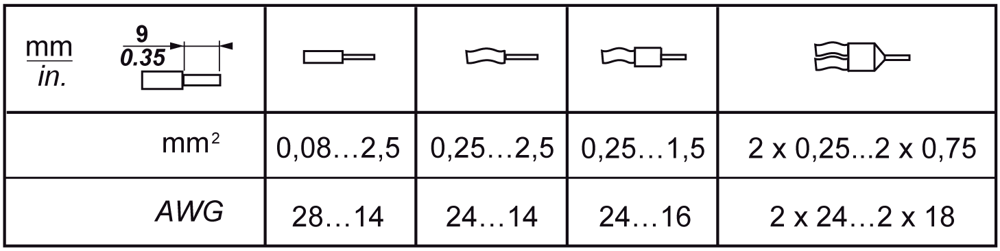
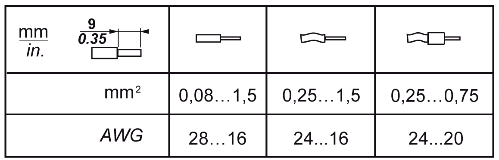

# Wiring Best Practices

## Introduction

There are several rules that must be followed when wiring the TM5 System.

## Wiring Rules

| DANGER | |
| --- | --- |
|  | HAZARD OF ELECTRIC SHOCK, EXPLOSION OR ARC FLASH  * Disconnect all power from all equipment including connected devices prior to removing any covers or doors, or installing or removing any accessories, hardware, cables, or wires except under the specific conditions specified in the appropriate hardware guide for this equipment. * Always use a properly rated voltage sensing device to confirm the power is off where and when indicated. * Replace and secure all covers, accessories, hardware, cables, and wires and confirm that a proper ground connection exists before applying power to the unit. * Use only the specified voltage when operating this equipment and any associated products.  Failure to follow these instructions will result in death or serious injury. |

The following rules must be applied when wiring the TM5 System:

* I/O and communication wiring must be kept separate from the power wiring. Route these 2 types of wiring in separate cable ducting.
* Verify that the operating conditions and environment are within the specification values.
* Use proper wire sizes to meet voltage and current requirements.
* Use copper conductors only.
* Use twisted pair, shielded cables for analog, expert, or fast I/O and TM5 bus signals.
* Use twisted pair, shielded cables for encoder, networks and fieldbus (CAN, serial, Ethernet).

Use shielded, properly grounded cables for all analog and high-speed inputs or outputs and communication connections. If you do not use shielded cable for these connections, electromagnetic interference can cause signal degradation. Degraded signals can cause the controller or attached modules and equipment to perform in an unintended manner.

| WARNING | |
| --- | --- |
|  | UNINTENDED EQUIPMENT OPERATION  * Use shielded cables for all fast I/O, analog I/O and communication signals. * Ground cable shields for all analog I/O, fast I/O and communication signals at a single point1. * Route communication and I/O cables separately from power cables.  Failure to follow these instructions can result in death, serious injury, or equipment damage. |

1Multipoint grounding is permissible if connections are made to an equipotential ground plane dimensioned to help avoid cable shield damage in the event of power system short-circuit currents.

Refer to the section [Grounding the TM5 System](../../../../../api/crossBook?lang=en-US&virtualBookName=m258pig&topicID=D_SE_0002601) to ground the shielded cables.

This table provides the wire sizes to use with the removable spring terminal blocks (TM5ACTB06, TM5ACTB12, TM5ACTB12, TM5ACTB12PS, TM5ACTB32):

This table provides the wire sizes to use with the TM5ACTB16 terminal blocks:

| DANGER | |
| --- | --- |
|  | FIRE HAZARD  * Use only the correct wire sizes for the maximum current capacity of the I/O channels and power supplies. * For relay output (2 A) wiring, use conductors of at least 0.5 mm2 (AWG 20) with a temperature rating of at least 80 °C (176 °F). * For common conductors of relay output wiring (7 A), or relay output wiring greater than 2 A, use conductors of at least 1.0 mm2 (AWG 16) with a temperature rating of at least 80 °C (176 °F).  Failure to follow these instructions will result in death or serious injury. |

The spring clamp connectors of the terminal block are designed for only one wire or one cable end. Two wires to the same connector must be installed with a double wire cable end to help prevent loosening.

| DANGER | |
| --- | --- |
|  | LOOSE WIRING CAUSES ELECTRIC SHOCK  Do not insert more than one wire per connector of the spring terminal blocks unless using a double wire cable end (ferrule).  Failure to follow these instructions will result in death or serious injury. |

## TM5 Terminal Block

Inserting an incorrect terminal block into the electronic module can cause unintended operation of the application and/or damage the electronic module.

| DANGER | |
| --- | --- |
|  | ELECTRIC SHOCK OR UNINTENDED EQUIPMENT OPERATION  Connect the terminal blocks to their designated location.  Failure to follow these instructions will result in death or serious injury. |

NOTE: To help prevent a terminal block from being inserted incorrectly, ensure that each terminal block and electronic module is clearly and uniquely [coded](../../../../../api/crossBook?lang=en-US&virtualBookName=m258pig&topicID=D_SE_0000888).

## TM5 Strain Relief Using Cable Tie

There are 2 methods to reduce the stress on cables:

* The [terminal blocks](../../../../../api/crossBook?lang=en-US&virtualBookName=m258pig&topicID=D_SE_0015379) have slots to attach cable ties. A cable tie can be fed through this slot to secure cables and wires to reduce stress between them and the terminal block connections.
* After grounding the TM5 System by means of the grounding plate TM2XMTGB, wires can be bundled and affixed to the grounding plate tabs using wire ties to reduce stress on the cables.

The following table provides the size of the cable tie and presents the two methods to reduce the stress on the cables:

| Cable Tie Size | Terminal Block | TM2XMTGB Grounding Plate |
| --- | --- | --- |
| Thickness | 1.2 mm (0.05 in.) maximum | 1.2 mm (0.05 in.) |
| Width | 4 mm (0.16 in.) maximum | 2.5...3 mm (0.1...0.12 in.) |
| Mounting illustration |  |  |

| WARNING | |
| --- | --- |
|  | ACCIDENTAL DISCONNECTION FROM PROTECTIVE GROUND (PE)  * Do not use the TM2XMTGB Grounding Plate to provide a protective ground (PE). * Use the TM2XMTGB Grounding Plate only to provide a functional ground (FE).  Failure to follow these instructions can result in death, serious injury, or equipment damage. |

EIO0000003715.04