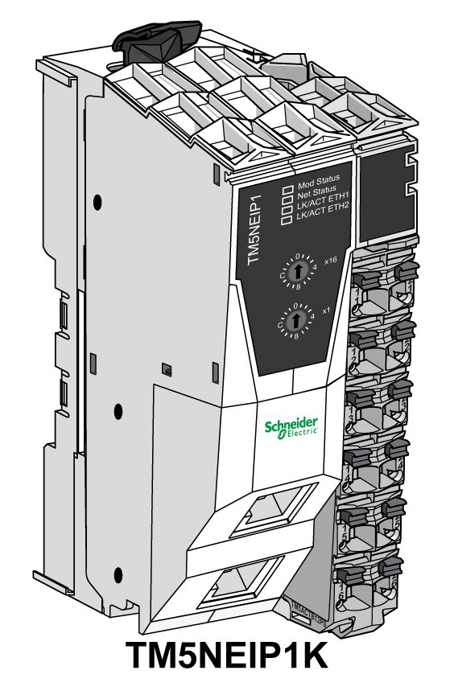

# TM5 EtherNet/IP Fieldbus Interface General Description

## Introduction

The TM5 EtherNet/IP Fieldbus Interface with built-in power distribution is the first element of the [TM5 distributed I/O island](../../../../../api/crossBook?lang=en-US&virtualBookName=m258pig&topicID=D_SE_0009280). When assembled together, the TM5 EtherNet/IP Fieldbus Interface is composed of four elements:

* Field bus Interface bus base
* Field bus interface module
* Interface Power Distribution Module (IPDM)
* Terminal block

The following figure shows a TM5 EtherNet/IP fieldbus interface when assembled:

## TM5 EtherNet/IP Field Bus Interface Features

The table below provides the bus base reference:

| Reference | Description |
| --- | --- |
| [TM5ACBN1](../../../../../api/crossBook?lang=en-US&virtualBookName=m258pig&topicID=D_SE_0009228) | Bus base for field bus interface module and Interface Power Distribution Module (IPDM) |

The table below provides the field bus interface module references:

| Reference | Description |
| --- | --- |
| [TM5NCO1](../../../../../api/crossBook?lang=en-US&virtualBookName=m258pig&topicID=D_SE_0015378) | CANopen interface module |
| [TM5NEIP1](D-SE-0094790.html#D-SE-0094790) | EtherNet/IP interface module |
| [TM5NS31](../../../../../api/crossBook?lang=en-US&virtualBookName=m258pig&topicID=D_SE_0015378) | SERCOS III interface module |

The table below provides the Interface Power Distribution Module (IPDM) reference:

| Reference | Description |
| --- | --- |
| [TM5SPS3](D-SE-0009141.html#D-SE-0009141) | Field bus interface 24 Vdc power supply |

The table below provides the terminal block reference:

| Reference | Description |
| --- | --- |
| [TM5ACTB12PS](../../../../../api/crossBook?lang=en-US&virtualBookName=m258pig&topicID=D_SE_0004137) | 24 Vdc, 12-pin terminal block for PDM, IPDM and Receiver electronic module |

EIO0000003715.04