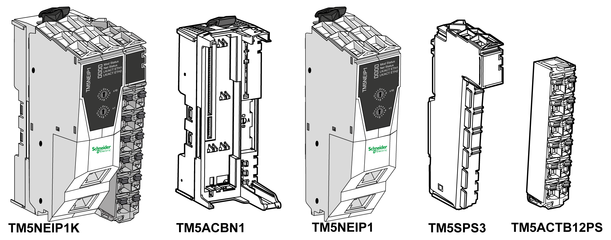
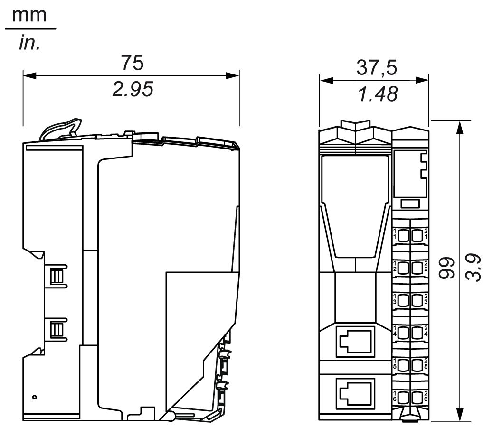

# TM5 EtherNet/IP Fieldbus Interface Physical Description

## Introduction

Each fieldbus interface consists of four elements. These elements are the:

* Fieldbus interface bus base
* Fieldbus interface module
* Interface Power Distribution Module (IPDM)
* Terminal block

## Elements

The following figure shows the different parts that compose the TM5 EtherNet/IP Fieldbus Interface:

**(TM5NEIP1K)** Fieldbus interface assembly

**(TM5ACBN1)** Fieldbus interface bus base

**(TM5NEIP1)** Fieldbus interface module

**(TM5SPS3)** Interface Power Distribution Module (IPDM)

**(TM5ACTB12PS)** Spring terminal block

## Dimensions

The following figure shows the dimensions of the TM5 EtherNet/IP Fieldbus Interface:

## Accessories

Refer to the [Installation of Accessories](../../../../../api/crossBook?lang=en-US&virtualBookName=m258pig&topicID=D_SE_0001024).

## Labeling

Refer to the [Labeling the TM5 System](../../../../../api/crossBook?lang=en-US&virtualBookName=m258pig&topicID=D_SE_0001023).

EIO0000003715.04