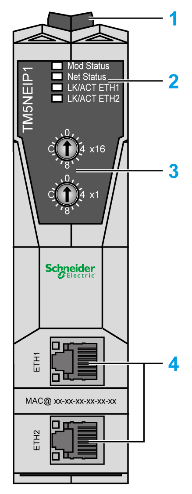
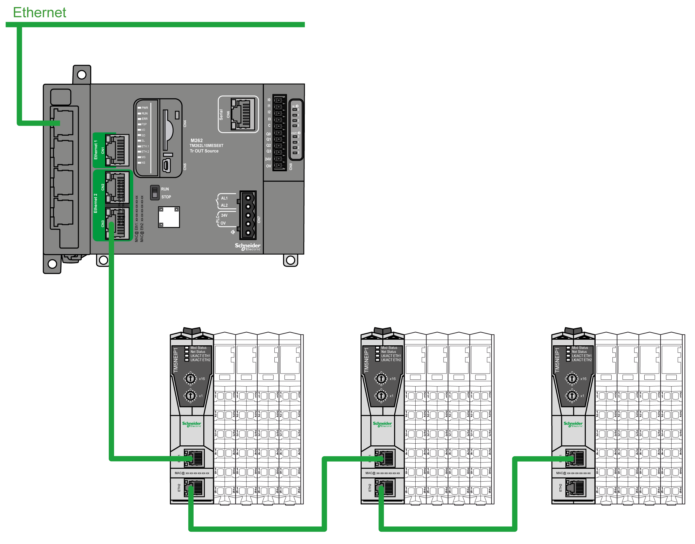
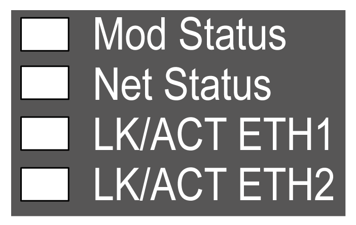

# TM5 EtherNet/IP Fieldbus Interface Presentation

## Overview

The TM5 EtherNet/IP Fieldbus Interface is a device designed to manage EtherNet/IP communication.

The main elements are:

**1** Clip-on lock for 35 mm (1.38 in.) top hat section rail (DIN rail)

**2** Status LEDs

**3** Rotary switches

**4** 2 RJ45 EtherNet/IP ports

## Main Characteristics

| Characteristic | Value |
| --- | --- |
| Rated power supply | 24 Vdc |
| Weight | 52 g (1.83 oz) |
| Rotary switch | 2 |
| Ethernet | 2 isolated switched Ethernet ports (100 Mb / 10 Mb) |

NOTE: The TM5 EtherNet/IP fieldbus interface supports only a line network topology.

## Distributed Configuration

The following illustration defines a distributed configuration with a controller:

## Status LEDs

The following figure and table provide the TM5NEIP1 IPDM status LEDs:

| LED | Color | Status | Description |
| --- | --- | --- | --- |
| Mod Status | - | Off | Power is removed. |
| Green | On | At least one client is connected. |
| Flashing | The TM5 interface is not configured. |
| Fast flashing | The TM5 is performing a firmware or configuration upload. |
| Red | On | The TM5 interface detected an error that is, in most circumstances, unrecoverable. |
| Flashing | The TM5 interface detected an error that is, in most circumstances, recoverable. |
| Green/Red | Flashing | The TM5 interface is performing a self-test. |
| Net Status | - | Off | No Ethernet connection is established. |
| Green | On | At least one active master (scanner) connection is established. |
| Flashing | No active master (scanner) connection established. |
| Red | On | An IP address has been used more than once. |
| Flashing | A connection for which the device is the target has timed out. |
| Green/Red | Flashing | The TM5 interface is performing a self-test. |
| LK/ACT ETH1  LK/ACT ETH2 | - | Off | No cable connected. No Ethernet connection is established. |
| Green | On | An Ethernet connection is established, but no communication exists. |
| Flashing | An Ethernet connection is established and communication exists. |

EIO0000003715.04