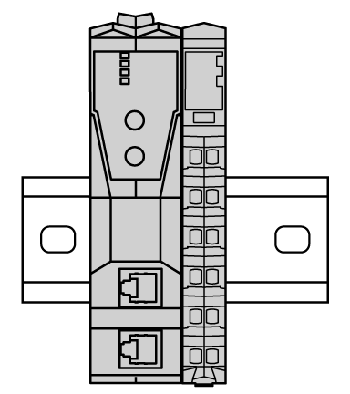
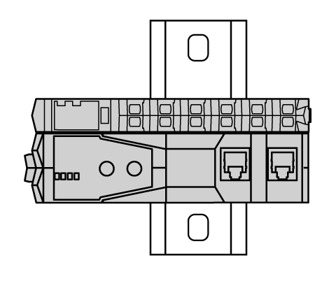
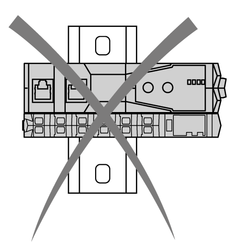
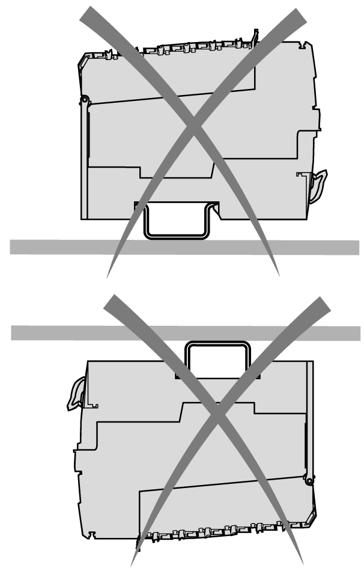
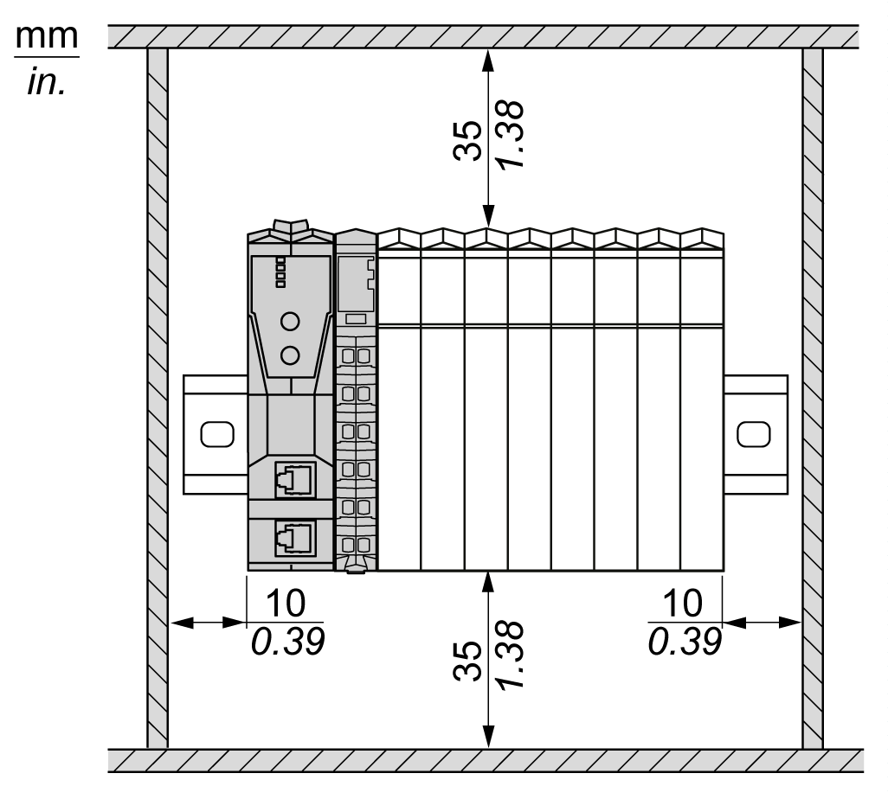
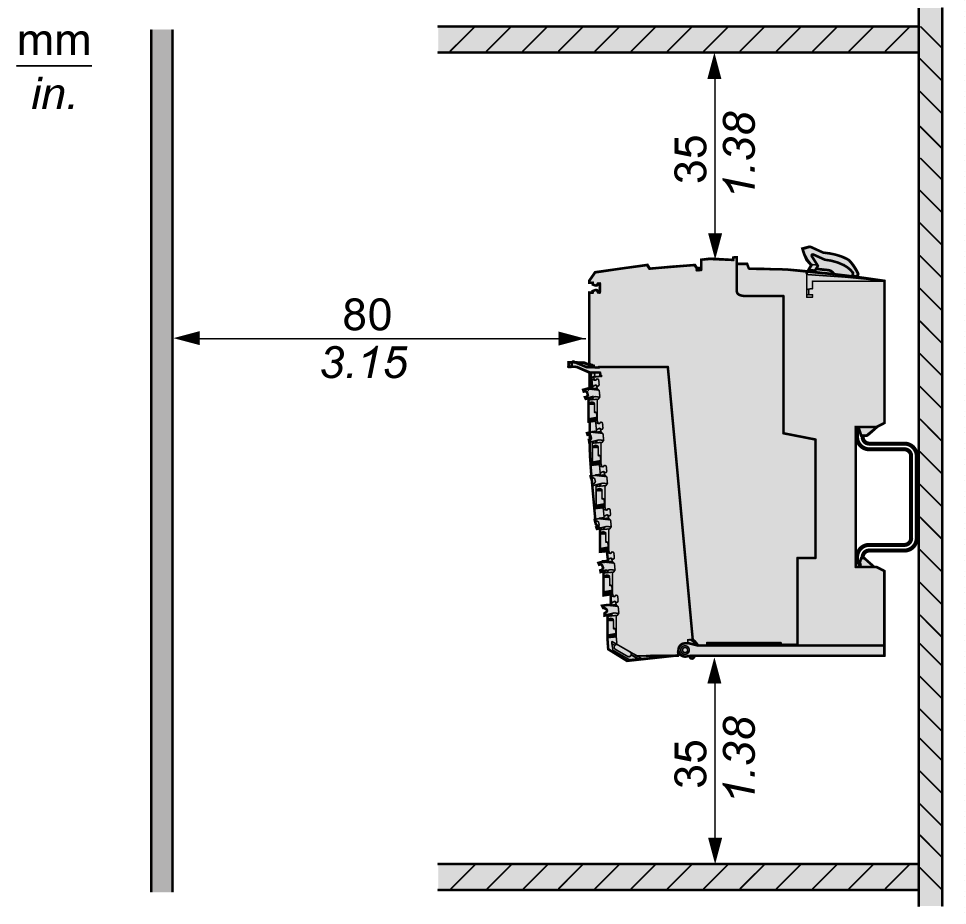

# Mounting Positions

## Introduction

This section describes the correct mounting positions for the TM5 EtherNet/IP Fieldbus Interface.

NOTE: Keep adequate spacing for proper ventilation and to maintain an ambient temperature as specified in the [Environmental Characteristics](D-SE-0002647.html#D-SE-0002647).

## Correct Mounting Position

Whenever possible, the TM5 EtherNet/IP Fieldbus Interface should be mounted horizontally on a vertical plane as shown in the figure below:

## Acceptable Mounting Position

Whenever possible, the TM5 EtherNet/IP Fieldbus Interface can also be mounted vertically with a temperature derating on a vertical plane as shown below:

## Incorrect Mounting Position

The figures below show the incorrect mounting positions:

## Mounting the Enclosure

The recommended clearance for the installed enclosures are shown in the figures below:

EIO0000003715.04