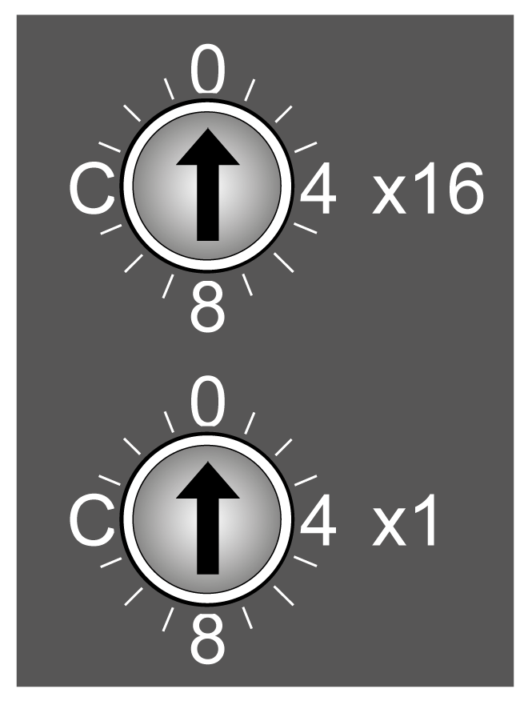
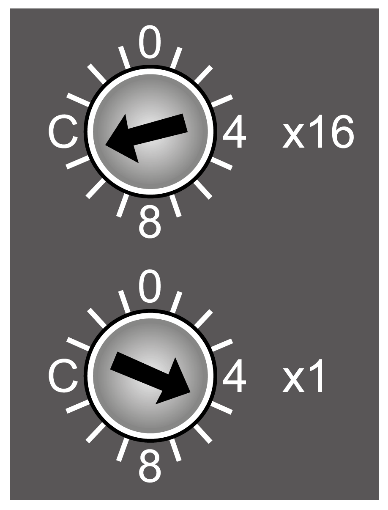

# Rotary Switch

## Overview

The two rotary switches located on the front panel of the TM5 EtherNet/IP Fieldbus Interface are used to set an IP address. By default, the value on the rotary switches is 0.

NOTE: Any modification of the rotary switch position is taken into account only after the next power cycle.

## Rotary Switch Position Example

The following figure shows an example of the rotary switch position to B5 (hex) = 181 (decimal):

**(x16)** High-order rotary switch: set to B (hex) = 11 (decimal)

**(x1)** Low-order rotary switch: set to 5 (hex) = 5 (decimal)

Rotary switches position value = B5 (hex) = 11x16 + 1x5 = 181 (decimal)

## Default Settings

The following table shows the default settings:

| Parameter | Value |
| --- | --- |
| IP Address | 10.10.xxx.xxx (1) |
| Subnet mask | 255.0.0.0 |
| Gateway | 0.0.0.0 |
| Primary NetBios | - |
| Secondary NetBios | - |
| **(1)** The last two fields in the default IP address are composed of the last two hexadecimal bytes of the MAC address of the fieldbus interface.  NOTE: A MAC address is always written in hexadecimal format and an IP address in decimal format. Convert the MAC address to decimal format. For example, if the MAC address is 00.80.F4.01.80.F2, the default IP address is 10.10.128.242.  NOTE: In case of MAC address ends with 00 hex, the IP address can not be zero in last field, but 128. For example, if the MAC address is 00.80.F4.01.80.00, the default IP address is 10.10.128.128. | |

NOTE: The MAC address value is printed on the front face of the fieldbus interface.

## Setting an IP Address

Set the rotary switches before:

* Applying power to the fieldbus interface.
* Downloading the application.

This table describes the configuration of the rotary switches:

| Position of the rotary switches (hex) | Description |
| --- | --- |
| **00** | The IP address stored in flash memory is used. |
| **01...7F** | Sets the fieldbus interface to DHCP mode for this range. A device name is generated according to how the network address switches are set.  Generated device name: "TM5NEIP1\_" + address switch position.  For example: 1F hex: "TM5NEIP1\_31" |
| **80...EF** | Sets the fieldbus interface to Fixed IP mode for this range. The IP address is read from the flash memory and the last position of the address is modified with the value of the rotary switches. The address in the flash memory remains unchanged.  For example: Stored IP address: 10.10.34.02, rotary switches: 80 hex => Fixed IP 10.10.34.128 |
| **F0** | [Clears the flash memory](#D-SE-0095437__D-SE-0095437.15). |
| **F1...FC** | Reserved. |
| **FD** | Resets all fieldbus interface parameters to default values during booting and reads the Ethernet parameters from the flash memory. |
| **FE** | Resets all fieldbus interface parameters to default values during booting. No values are read from flash memory. The Ethernet parameters correspond to the default values. |
| **FF** | Resets the Ethernet parameters to default values. The other fieldbus interface parameters are read from flash memory. |

Carefully manage the IP addresses because each device on the network requires a unique address. Having multiple devices with the same IP address can cause unintended operation of your network and associated equipment.

| WARNING | |
| --- | --- |
|  | UNINTENDED EQUIPMENT OPERATION  * Verify that there is only one master controller configured on the network or remote link. * Verify that all devices have unique addresses. * Obtain your IP address from your system administrator. * Confirm that the IP address of the device is unique before placing the system into service. * Do not assign the same IP address to any other equipment on the network. * Update the IP address after cloning any application that includes Ethernet communications to a unique address.  Failure to follow these instructions can result in death, serious injury, or equipment damage. |

NOTE: This device comes pre configured with an IP address of 10.10.xxx.xxx. It is good practice to ensure that your system administrator maintains a record of all assigned IP addresses on the network and subnetwork, and to inform the system administrator of all configuration changes performed.

## Clearing the Flash Memory

| Step | Action |
| --- | --- |
| 1 | Turn off the power supply to the bus controller. |
| 2 | Set the rotary switch position to F0 hex. |
| 3 | Turn on the power supply to the bus controller. |
| 4 | Wait until the Mod Status LED flashes green for 5 seconds. The rotary switch position must be set first to 00 hex, and then back to F0 hex within this time window of 5 seconds. |
| 5 | Wait until the Mod Status LED flashes with a red double-flash (flash memory has been cleared). |
| 6 | Turn off the power supply to the bus controller. |
| 7 | Set the desired rotary switch position (00 hex - EF hex). |
| 8 | Turn on the power supply to the bus controller.  **Result:** The bus controller boots with the configured rotary switch position. |

## Applying the IP Address Through DHCP

The DHCP server will provide the IP address to the fieldbus interface. The rotary switch must be set between 01...7F (1...127) to correspond to the DHCP name used for obtaining the IP address.

## Applying the IP Address Manually

Ethernet parameters can be modified in the following ways:

* Using the [Web server](../../../../../api/crossBook?lang=en-US&virtualBookName=TM5NEIP1prg&topicID=D_SE_0095068)
* Using the TCP/IP interface object [class F5 hex](../../../../../api/crossBook?lang=en-US&virtualBookName=TM5NEIP1prg&topicID=D_SE_0092113)

If the IP address is set using the TCP/IP object, the new address is saved to the flash memory if attribute 3 (configuration control) of the TCP/IP object is set to 0.

Changes to attributes in the TCP/IP object are automatically stored to the flash memory. In either case, modified by the Web server or the TCP/IP object, the modified IP address is applied after a power cycle of the fieldbus interface if the position of the rotary switches is set to 00.

EIO0000003715.04