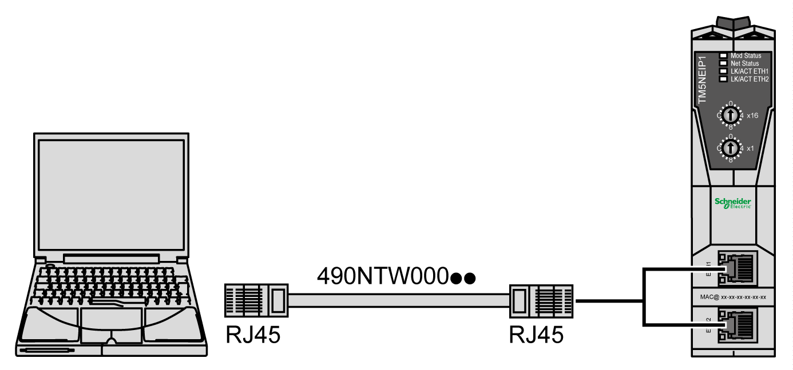

# Connecting the TM5NEIP1 to a PC

## Overview

You can connect the TM5NEIP1 to a PC through the Ethernet ports.

## Ethernet Port Connection

To connect the TM5NEIP1 to a PC using the Ethernet ports:

To connect the TM5NEIP1 to the PC, do the following:

| Step | Action |
| --- | --- |
| 1 | Connect the Ethernet cable to the PC. |
| 2 | Connect the Ethernet cable to one of the Ethernet ports on the TM5NEIP1. |
| 3 | Set the rotary switch to the 00 position. |
| 4 | Identify the IP address of the fieldbus interface.  Example:   * MAC5 = 80 hex and MAC6 = 37 hex * IP address is 10.10.128.39 |
| 5 | Adjust the network adapter settings and set the IP address in same subnet.  Example:   * IP address: 10.10.128.1 * Subnet: 255.255.255.0 * Gateway: 0.0.0.0 |
| 6 | Open CMD window and execute ping command to test the EtherNet/IP communication to the fieldbus interface. If a timeout occurs, go back to step 4.  Example:   * Ping 10.10.128.39 must reply without timeouts |
| 7 | Open a web browser and enter address 10.10.128.39 to open the Web server.  NOTE: The Web Server is disabled by default. To get Web access you need to download a M262 or M241 configuration. The web server can be enabled or disabled in the **Configuration Stream** tab of the EcoStruxure Machine Expert software. For more details, refer to the [Modicon TM5 EtherNet/IP Fieldbus Interface, Programming Guide](../../../../../api/crossBook?lang=en-US&virtualBookName=TM5NEIPprg&topicID=D_SE_0092113). |

EIO0000003715.04