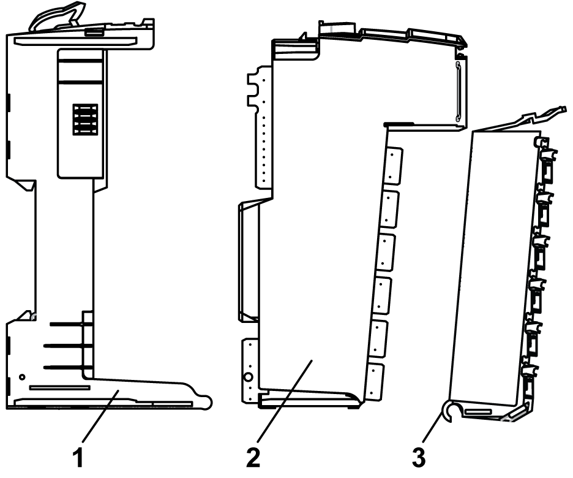
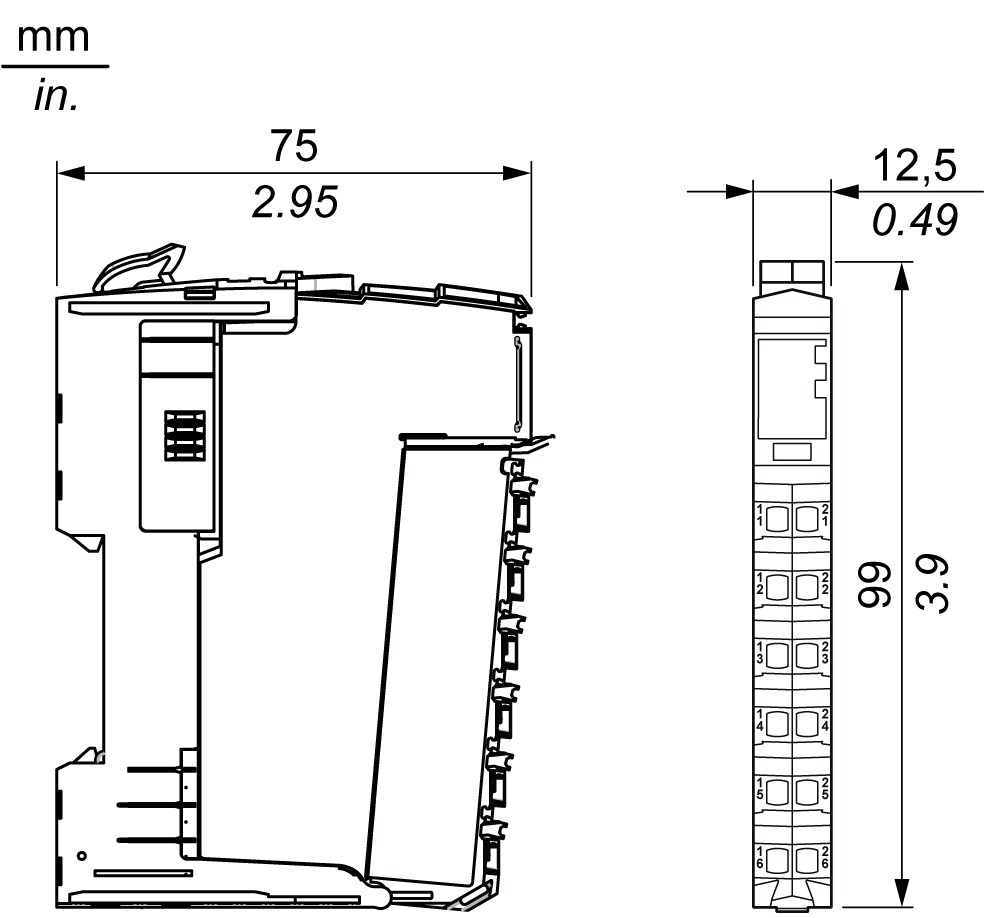
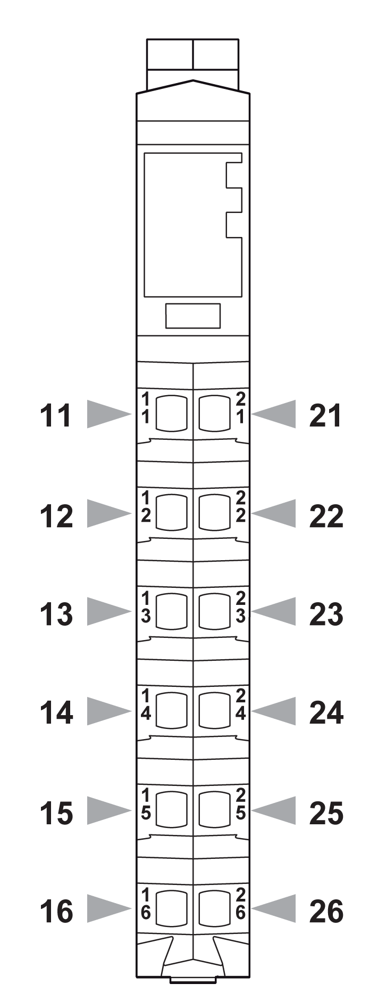

# Physical Description

## Introduction

Each slice consists of three elements. These elements are the bus base, the electronic module and the terminal block.

## Elements

The following illustration shows the elements of a slice.

**1** Bus base

**2** Electronic module

**3** Terminal block

When assembled the three components form an integral unit that resists vibration and electrostatic discharge.

| NOTICE | |
| --- | --- |
|  | ELECTROSTATIC DISCHARGE  * Never touch the contacts of the electronic module. * Always keep the connector in place during normal operation.  Failure to follow these instructions can result in equipment damage. |

## Dimensions

The following illustration shows the dimensions of a slice:

## Pin Assignment

The following illustration shows the pin assignments for the 12-pin terminal block:

## Accessories

Refer to the [*Installation of Accessories*](../../../../../api/crossBook?lang=en-US&virtualBookName=pacdpig&topicID=D_SE_0001024).

## Labeling

Refer to the [*Labeling the* TM5 System](../../../../../api/crossBook?lang=en-US&virtualBookName=pacdpig&topicID=D_SE_0001023).

EIO0000004071.03

© 2021

Schneider Electric.

All rights reserved.