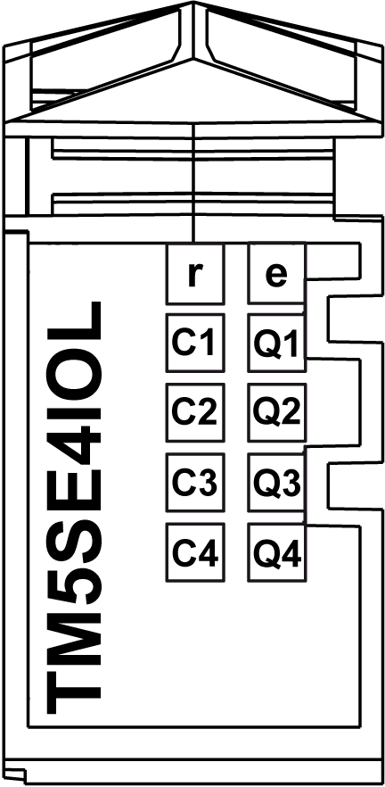

# TM5SE4IOL Presentation

## Main Characteristics

|  |  |
| --- | --- |
| Characteristic | Value/description |
| Power consumption of the module | * TM5 bus: 0.01 W * 24 Vdc I/O segment: 0.71 W |
| Number of input channels | * Up to four IO-Link devices * Up to four digital channels (configurable as input or output) |
| IO-Link | IO-Link master |
| Input type | Refer to [Characteristics](D-SE-0099640.html#D-SE-0099640__D-SE-0099640.5). |
| Input signal type | Sink |
| Output type | Refer to [Characteristics](D-SE-0099640.html#D-SE-0099640__D-SE-0099640.5). |
| Output signal type | Source |
| Output current | 0.25 A per channel |
| Rated input voltage | 24 Vdc |

## Ordering Information

The following table lists the commercial references of the terminal blocks and the bus bases to be used with the IO-Link module TM5SE4IOL:

| Number | Commercial reference | Description | Color |
| --- | --- | --- | --- |
| 1 | TM5ACBM11 | Bus base | White |
| 2 | TM5SE4IOL | Electronic module | White |
| 3 | TM5ACTB12 | Terminal block, 12 pins | White |

NOTE: For more information, refer to [*TM5 bus bases and terminal blocks*](../../../../../api/crossBook?lang=en-US&virtualBookName=pacdpig&topicID=D_SE_0004365).

## Status LEDs

Status LEDs of the IO-Link module TM5SE4IOL:

The following table explains the status LEDs of the IO-Link module TM5SE4IOL:

| LED | Color | Status | Description |
| --- | --- | --- | --- |
| r | Green | Off | No power supply |
| Single flash | Reset state |
| Flashing | Preoperational state |
| Double flash | Boot state (during firmware update)1 |
| On | Regular operation |
| e | Red | Off | OK or no power supply |
| On | Error detected or reset state |
| Double flash | Internal errror detected |
| C1 - C4 | Red | On | Overcurrent/short circuit on the supply or on the C/Q line of the channel |
| Green/Red | Off | Interface in SIO (Standard Input Output) |
| Single flash | Channel in Operate mode, no IO-Link communication |
| Double flash | Channel in Operate mode, [inspection level](D-SE-0099701.html#D-SE-0099701__D-SE-0099701.2) error detected. |
| Green | On | Channel in Operate mode, IO-Link communication active |
| Q1 - Q4 | Orange | - | Input/output state of corresponding IO-Link interface |
| (1) Depending on the configuration, a firmware update can take up to several minutes. | | | |

EIO0000004071.03

© 2021

Schneider Electric.

All rights reserved.