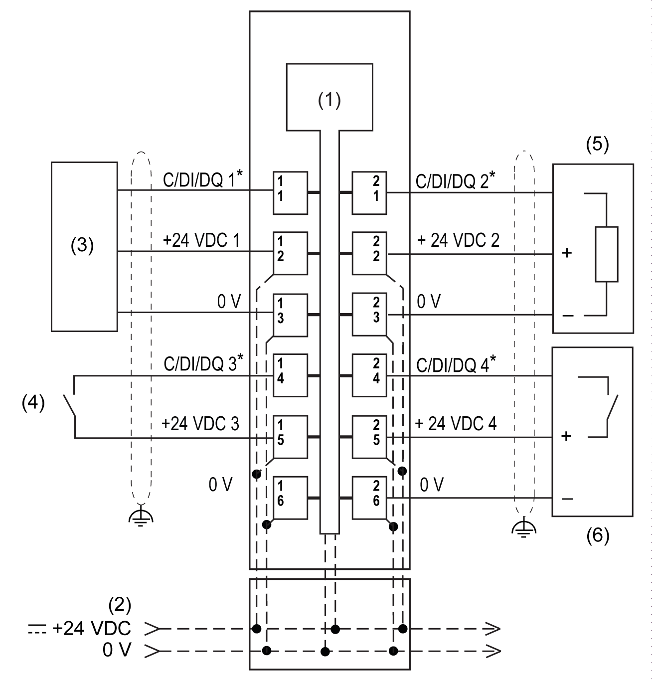

# TM5SE4IOL Wiring Diagram

## Wiring Diagram

Wiring diagram IO-Link module TM5SE4IOL:

**1** Internal electronics

**2** 24 Vdc I/O power segment integrated into the bus bases

**3** IO-Link device

**4** IO-Link 2-wire sensor

**5** IO-Link actuator

**6** IO-Link 3-wire sensor

**\*** C/DI/DQ: Configurable as communication, input, or output 24 Vdc

| WARNING | |
| --- | --- |
|  | UNINTENDED EQUIPMENT OPERATION  Do not connect wires to unused terminals and/or terminals indicated as “No Connection (N.C.)”.  Failure to follow these instructions can result in death, serious injury, or equipment damage. |

| WARNING | |
| --- | --- |
|  | UNINTENDED EQUIPMENT OPERATION  Use the sensor and actuator power supply only for supplying power to sensors or actuators connected to the module.  Failure to follow these instructions can result in death, serious injury, or equipment damage. |

EIO0000004071.03

© 2021

Schneider Electric.

All rights reserved.