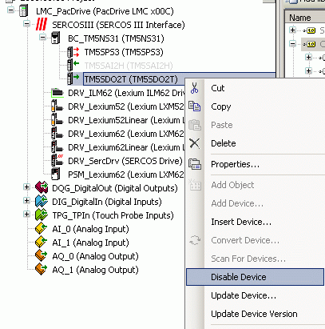
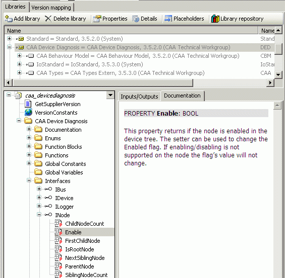
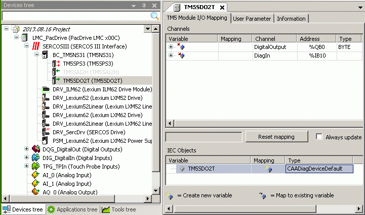

# Enabling/Disabling TM5/TM7 Modules

## General

It is possible to enable and disable TM5 and TM7 modules either offline or via an IEC application during runtime.

Hence, using a configuration which includes the types of machines can enable or disable the TM5 or TM7 modules, depending on the type of machine.

NOTE: Disabled modules do not require the processing capacity of the controller and the bandwidth of the Sercos bus.

## Offline

In order to disable a TM5/TM7 module offline, click the module using the right mouse button and select Disable device from the context menu.

The disabled module is displayed in light gray.



For a disabled module, then, the Enable device command is available in the context menu.

## Application

Using an application, the module can be enabled or disabled via the INode interface of a TM5/TM7 module.



When Enable of the INode interface is set to TRUE, the module is enabled. By setting it to FALSE, it is disabled.

NOTE: A modification of the value for Enable is immediately visible, however, it will only be effective after a new Sercos phase up (phase 0 => phase 4).

The TM5/TM7 module provides the INode interface via the CAADiagDeviceDefault object.



## Example

```
IF xEnable = TRUE THEN
   TM5SDO2T.Enable := TRUE;
 ELSE
   TM5SDO2T.Enable := FALSE;
 END_IF
```

## TM5/TM7 Safety Modules

TM5/TM7 safety modules can be enabled and disabled too.

However, these modules must then be configured as optional modules in the EcoStruxure Machine Expert - Safety software.

NOTE: The value Yes must be assigned to the Optional parameter of a safety module in EcoStruxure Machine Expert - Safety.

EIO0000002196.02