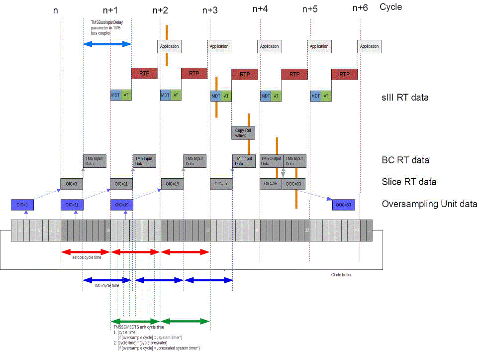

# Configuration of Timing Parameters

## General

The TM5SDM8DTS module can be used with different cycle times.

For ease of use, the oversampling input and output features are used with a configuration where Sercos cycle time and the TM5SDM8DTS units cycle time are equal to the TM5 cycle time.

With equal cycle times, the module is consistently supplied with oversampled output data.If not, the feature may not be consistently applied without special consideration of the cycle times used.

To configure the timing, several parameters have to be configured in the system:

| Cycle time | Parameter | Description |
| --- | --- | --- |
| Sercos cycle time | Cycle Time  Refer to Sercos Interface. | Parameter in Sercos Devices tree object |
| TM5 cycle time | TM5 cycle time  Refer to [Sercos III bus interface (TM5NS31)](D-SE-0068531.html#D-SE-0068531). | Parameter in TM5NS31 Devices tree object |
| TM5SDM8DTS units cycle time | Cycle Time  Cycle prescaler  Oversample cycle | User parameters of the TM5SDM8DTS module |

The following graphic presents the different cycle time parameters when the the parameters are equal.

Cycle time parameters

|  |  |
| --- | --- |
|  | Sercos cycle time |
|  | TM5 cycle time |
|  | TM5SDM8DTS units cycle time |
| RTP | Real-Time Process |
| MDT | Master Data Telegram |
| AT | Acknowledged Telegram |
| sIII RT data | Sercos Real-Time data |
| BC RT data | Bus Coupler (Sercos III bus interface, TM5NS31) Real-Time data |
| Slice RT data | TM5SDM8DTS Real-Time data |

If the configuration generates a cycle difference between the Sercos cycle time, the TM5 cycle time and the TM5SDM8DTS units cycle time, the behavior depends on the type of difference. The cases of differential cycle times are described below:

## Case 1 / Case 2

Case 1: Sercos cycle time > TM5 cycle time

Case 2: Sercos cycle time = TM5 cycle time AND TM5 cycle time > TM5SDM8DTS units cycle time

In the two cases, the oversampled output buffer cannot be supplied with data in time because in each Sercos cycle only one 8-bit pattern (32-bit pattern for high frequency oversampled outputs) can be sent to the oversampled output buffer. For example, if the Sercos cycle time is 2 ms, every 2 ms eight buffer entries can be filled. If the buffer entries are read by the TM5SDM8DTS and written to the physical outputs faster than this rate, the module sets the OutputControlError bit to TRUE (which continues to be presented at each cycle) because the buffer is not replenished at a sufficient rate (refer to [Oversampling Outputs Buffer Handling on the Module](D-SE-0070075.html#D-SE-0070075__D-SE-0070075.7)).

For inputs, data is lost in these cases. If, for example, Sercos cycle time is 2 ms while TM5 cycle time and TM5SDM8DTS units cycle time are 1 ms, the data is often written more to the TM5 bus than is read by the Sercos bus, leading to overwritten data.

## Case 3 / Case 4

Case 3: Sercos cycle time < TM5 cycle time

Case 4: Sercos cycle time = TM5 cycle time AND TM5 cycle time < TM5SDM8DTS units cycle time

If oversampled output is used, the application does not have to provide an 8-bit pattern (32-bit pattern for high frequency oversampled outputs) on every Sercos cycle.

If, for example, Sercos cycle time is 1 ms but TM5 cycle time = TM5SDM8DTS units cycle time is 2 ms, the application only needs to provide an 8-bit pattern (32-bit pattern for high frequency oversampled outputs) on every second Sercos cycle.

Each input data is active for more than one Sercos cycle.

If, for example, Sercos cycle time is 1 ms while TM5 cycle time and TM5SDM8DTS units cycle time are 2 ms, the inputs are unaffected for two Sercos cycles within the application.

## Example Configurations for Different Cycle Times

| Cycle time | Parameter | Value |
| --- | --- | --- |
| 1 ms | Sercos cycle time = | 1000000 |
| TM5 cycle time = | 1000 μs / 6 |
| TM5SDM8DTS user parameters:  Cycle Time =  Cycle prescaler =  Oversample cycle = | 1000  N/A (1)  System timer |
| 2 ms | Sercos cycle time = | 2000000 |
| TM5 cycle time = | 2000 μs / 4 |
| TM5SDM8DTS user parameters:  Cycle Time =  Cycle prescaler =  Oversample cycle = | 2000  N/A (1)  System timer |
| 4 ms | Sercos cycle time = | 4000000 |
| TM5 cycle time = | 4000 μs / 4 |
| TM5SDM8DTS user parameters:  Cycle Time =  Cycle prescaler =  Oversample cycle = | 2000  2  Prescaled system timer |
| **(1)** The value is not relevant to the cycle time if the Oversample cycle is set to the system timer. In that case, any valid value is allowable. | | |

EIO0000002196.02