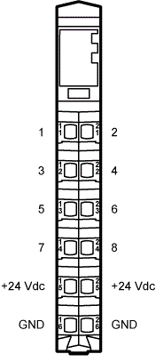

# General Information on TM5SDM8DTS

This document describes the parameters of the TM5SDM8DTS module and the configuration profiles of the module.

For hardware description, refer to the Modicon TM5 Digital I/O Modules Hardware Guide.

The TM5SDM8DTS module is a fast digital I/O module with high resolution.

This module in the TM5 module range provides:

* Regular digital inputs and outputs
* Oversampled inputs and outputs (eight bits per cycle)
* High frequency oversampled inputs and outputs (32 bits per cycle)
* Time-stamped outputs (time-stamped edge)
* Touchprobe inputs (detected edge related to encoder position; realized in the background through time-stamp)

When you add a TM5SDM8DTS module to your application program, you have to select one of the configuration profiles for the module.

Depending on the configuration profile you select, different types of inputs and outputs are available for the module.

**Six Configuration Profiles**

You can choose between six configuration profiles for the TM5SDM8DTS modules within EcoStruxure Machine Expert.

You can add each of the following device objects to the Devices tree under a Sercos III bus interface (TM5NS31):

* [TM5SDM8DTS\_TSIOO](D-SE-0070072.html#D-SE-0070072) (four touchprobe inputs, four oversampled outputs)
* [TM5SDM8DTS\_OIOO](D-SE-0070098.html#D-SE-0070098) (four oversampled inputs, four oversampled outputs)
* [TM5SDM8DTS\_TSITSO](D-SE-0070099.html#D-SE-0070099) (four touchprobe inputs, four time-stamped outputs)
* [TM5SDM8DTS\_OITSO](D-SE-0070101.html#D-SE-0070101) (four oversampled inputs, four time-stamped outputs)
* [TM5SDM8DTS\_HFOIDO](D-SE-0070102.html#D-SE-0070102) (four high frequency oversampled inputs, four regular digital outputs)
* [TM5SDM8DTS\_DIHFOO](D-SE-0070103.html#D-SE-0070103) (four regular digital inputs, four high frequency oversampled outputs)

The reference to touchprobe inputs is to the functionality of touchprobe within PacDrive. The profiles TM5SDM8DTS\_TSIOO and TM5SDM8DTS\_TSITSO configure the module inputs as time-stamped inputs in support of the touchprobe functionality (for more information, refer to the Modicon TM5 Digital I/O Modules Hardware Guide).

NOTE: The references in the present document to touchprobe inputs is specifically to the configuration of the physical inputs as time-stamped inputs.

If the TM5SDM8DTS module is inserted by the device addressing editor during a Sercos device scan, the system inserts the module with a configuration profile TM5SDM8DTS\_TSIOO.

| WARNING | |
| --- | --- |
|  | UNINTENDED EQUIPMENT OPERATION  Update your application program as required, paying particular attention to I/O address adjustments, whenever you modify the hardware configuration.  Failure to follow these instructions can result in death, serious injury, or equipment damage. |

**Channels - Inputs/Outputs**

Every channel on the module represents one input/output in the software.

| Channel | Functionality |
| --- | --- |
| 1, 2, 5, 6 | Input functionalities |
| 3, 4, 7, 8 | Output functionalities |
| +24 Vdc, GND | Auxiliary supply  Can be used to supply, for example, touchprobe sensors. |

EIO0000002196.02