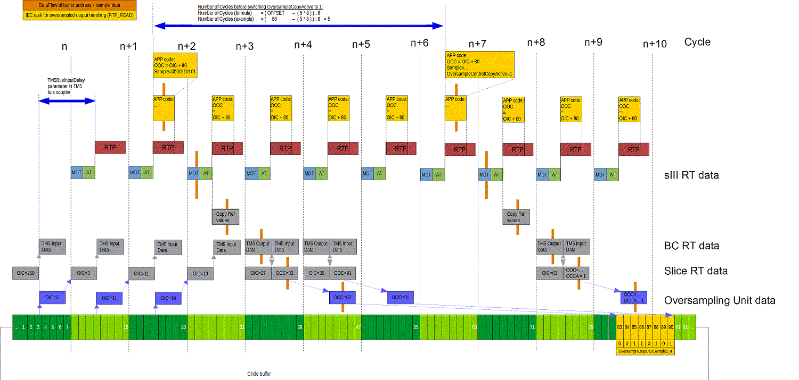

# Oversampled Outputs

## Contents of This Topic

This topic contains the following information:

* [General information on oversampled outputs](#D-SE-0070075__D-SE-0070075.3)
* [Initializing the handling of the oversampled outputs](#D-SE-0070075__D-SE-0070075.5)
* [Oversampling outputs buffer handling on the module](#D-SE-0070075__D-SE-0070075.7)
* [Example](#D-SE-0070075__D-SE-0070075.8)
* [TM5 Bus input delay](#D-SE-0070075__D-SE-0070075.9)
* [Controlling the oversampled outputs](#D-SE-0070075__D-SE-0070075.10)

## General Information on Oversampled Outputs

The oversampled output functionality on the module can be used via the I/O mapped registers of the Sercos III module.

To enable the evaluation of the output variables on the module, the parameter OutputsActiveSet (Bus Interface TM5NS31) has to be set to on / 1.

The parameter OutputsActive will then switch to on / 1 after the outputs are active on the module.

## Initializing the Handling of the Oversampled Outputs

Initialize the handling of the oversampled output as follows:

| Step | Action |
| --- | --- |
| 1 | Create a new program POU that is called in every Sercos cycle. |
| 2 | Enable OversampleEnable (in [OversampleControl](D-SE-0068997.html#D-SE-0068997)).  **Result:** OversampleInputCycle shows the present position in the oversampling buffer. |
| 3 | Set OversampleOutputCycle := OversampleInputCycle + OFFSET cyclic and write an 8-bit pattern to OversampleOutput0xSample1\_8.  **Result:** After the data is received by the TM5SDM8DTS module, it will copy this 8-bit pattern to the address OversampleOutputCycle inside the buffer. |
| 4 | NOTE: You must calculate the number of cycles to wait before you set the OversampleControlCopyActive bit in the OversampleControl byte. As you see in the [example graphic](#D-SE-0070075__D-SE-0070075.8), the formula is the following:  Number of cycles to wait before setting the OversampleCopyActive bit to 1 = (OFFSET - (five cycles x eight entries per cycle)) / eight entries per cycle  After having written sufficient data to the buffer, ensure that the present read position is at a point where you have written data, enable the OversampleControlCopyActive bit in OversampleControl. This needs to be done only once; if you attempt to modify this flag thereafter, a detected error is generated.  **Result:** The module begins to set the buffer values to the physical output channels. |

## Oversampling Outputs Buffer Handling on the Module

The TM5SDM8DTS module has a circle buffer with 256 entries for each oversampled output channel.

Every 1/8 cycle, the oversampling unit switches to the next entry inside the buffer and copies the buffer position into the I/O mapped OversampleInputCycle if OversampleEnable is set (in [OversampleControl](D-SE-0068997.html#D-SE-0068997)).

To write new values to the buffer, you have to set the OversampleOutputCycle value.

The value is the buffer address which is intended to be written to with the output values.

In addition, OversampleOutput0xSample1\_8 must be filled with the output values to write to this buffer address.

The destination addresses that you provide to the OversampleOutputCycle cannot exceed the present address +128.

This is called oversampled output window.

If the OversampleOutputCycle is greater than the present buffer address +128, the module raises an OutputCopyError flag.

If you set the OversampleControlCopyActive, the unit writes the value of the entry to the physical output channel and marks the entry as used.

If the output unit comes to an entry that is marked as used and you have set the OversampleControlCopyActive (in [OversampleControl](D-SE-0068997.html#D-SE-0068997)), the output unit sets the physical output channel to 0 and raises the OutputControlError flag.

NOTE: This detected error flag also occurs if it has been set and you unset it during program execution.

## Example

The following graphic presents an example of the handling of OversampleInputCycle / OversampleOutputCycle and OversampleOutput0xSample1\_8.

* After setting OversampleEnable to 1, the module begins to copy the buffer position to the real-time data (in cycle n–1).
* The real-time data is read by the Sercos III master in cycle n.
* Then the data is available in the next tasks cycIe.
* The task then calculates the buffer position for the sample data by OversampleOutputCycle = OversampleInputCycle + 80.
* In addition, the sample data OversampleOutput0xSample1\_8 for the respective output channel is set with a pattern.
* This data is copied into the next Sercos III real-time data.
* The data is available one cycle later in the bus interface and the module.
* Then the module copies the eight bits OversampleOutput0xSample1\_8 to the OversampleOutputCycle position in the buffer.

NOTE: You must calculate the number of cycles to wait before you set the OversampleControlCopyActive bit in the OversampleControl byte. As you see in the example graphic, the formula is the following: Number of cycles to wait before setting the OversampleCopyActive bit to 1 = (OFFSET - (5 cycles x 8 entries per cycle)) / 8 entries per cycle

Usage of OversampleInput/OutputCycle

|  |  |
| --- | --- |
|  | Data flow of buffer address + sample data |
|  | Task for oversampled output handling |
| RTP | Real-Time Process |
| MDT | Master Data Telegram |
| AT | Acknowledged Telegram |
| sIII RT data | Sercos III Real-Time data |
| BC RT data | Bus Coupler (Sercos III bus interface, TM5NS31) Real-Time data |
| Slice RT data | TM5SDM8DTS Real-Time data |

Verify that:

* OversampleControlCopyActive is not activated before the output unit is reaching buffer address 83; otherwise an OutputControlError is detected.
* OversampleOutputCycle is not less than OversampleInputCycle + 56.

  This time is needed for reading in the OversampleInputCycle from the unit in the module -> Slice RT data -> BC RT data -> sIII RT data -> tasks process data and writing OversampleOutputCycle back down to the modules oversampling unit.
* OversampleOutputCycle is not greater than the active buffer entry position +128; otherwise an OutputCopyError is detected.

## TM5 Bus Input Delay

For handling the oversampled outputs, it is necessary to know the delay between latching the inputs from the hardware and the beginning of the next Sercos cycle.

This delay in μs is shown in the TM5 bus interface parameter TM5BusInputDelay after Sercos phase up.

The parameter TM5BusInputDelay in the TM5 bus interface (TM5NS31) Devices tree object shows the delay between the input latch time and the beginning of the next RTP process cycle.

The length of one TM5 bus cycle has to be added to the result of the parameter if the input delay on the module has to be calculated because the TM5SDM8DTS module needs an extra TM5 cycle to latch the input data.

This depends on the hardware of this module. To get the time when the OversampledInputCycle read by your program was active, you can use the formula:

TM5BusInputDelay + [TM5 cycle time in μs]

## Controlling the Oversampled Outputs

Oversample outputs support the output of an 8-bit pattern per cycle.

Each bit represents 1/8 of a cycle and is set active for cycle time in μs / 8.

For handling the oversampled outputs, the following I/O variables are relevant:

## OversampleControl

OversampleControl

* OversampleEnable
* OversampleControlCopyActive

With the OversampleControl bits, the oversampling mechanism of the module is activated.

To enable the functionality, bit 0 (OversampleEnable) has to be set.

After setting bit 0 to 1, the module begins to read from its circle buffer.

The module copies its position inside the buffer to the OversampleInputCycle variable.

Then set OversampleOutputCycle to OversampleInputCycle + OFFSET in every cycle.

The module reads eight bits from the buffer in every cycle. This leads to an increase of 8 in the OversampleInputCycle per cycle.

With the cyclic operation OversampleOutputCycle = OversampleInputCycle + OFFSET, the buffer address is also increased by eight (see [example](#D-SE-0070075__D-SE-0070075.7)).

## ErrorState / ErrorQuit

ErrorState

* OutputControlError
* OutputCopyError

The OutputControlError bit is set if the module did not receive new data in time, meaning that a bit that has already been output would have been output again. The OutputCopyError bit is set if the oversampling output data could not be copied to the output control buffer. For more details, refer to [Oversampling Outputs Buffer Handling on the Module](#D-SE-0070075__D-SE-0070075.7).

ErrorQuit

* QuitOutputControlError
* QuitOutputCopyError

The QuitOutputControlError and QuitOutputCopyError bits can be used to reset the respective detected errors on the module.

## OversampleInputCycle / OversampleOutputCycle

The OversampleInputCycle is the address in the buffer, where the oversampling unit in the module reads the last bit value from.

The OversampleOutputCycle is the address in the buffer, where the OversampleOutput0xSample1\_8 are written to.

## OversampleOutput0xSample1\_8

The parameters have the following physical channel mapping on the module (refer to [General Information on TM5SDM8DTS](D-SE-0070065.html#D-SE-0070065)):

| Parameter | Channel |
| --- | --- |
| OversampleOutput01Sample1\_8 | 3 |
| OversampleOutput02Sample1\_8 | 4 |
| OversampleOutput03Sample1\_8 | 7 |
| OversampleOutput04Sample1\_8 | 8 |

EIO0000002196.02