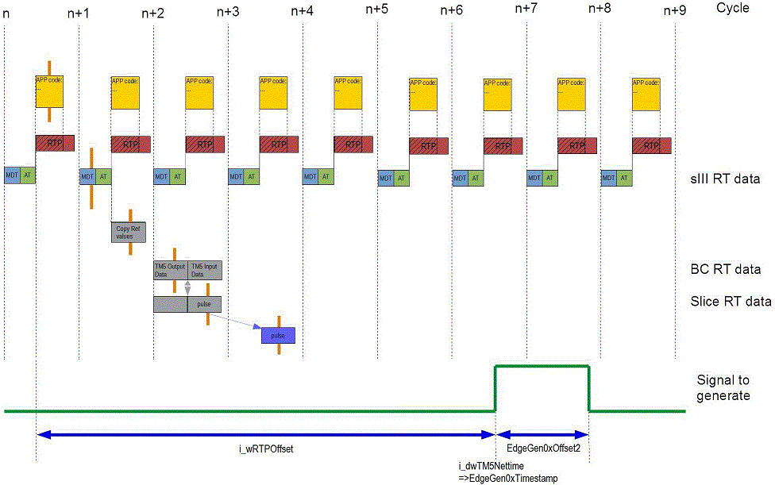

# Time-Stamped Outputs

## Contents of This Topic

This topic contains the following information:

* [General information on time-stamped outputs](#D-SE-0068987__D-SE-0068987.3)
* [Edge generation cycle](#D-SE-0068987__D-SE-0068987.4)
* [Calculating a time-stamp](#D-SE-0068987__D-SE-0068987.5)
* [Configuration of a time-stamped output](#D-SE-0068987__D-SE-0068987.6)
* [Example implementation](#D-SE-0068987__D-SE-0068987.7)
* [Internal time stamp buffer](#D-SE-0068987__D-SE-0068987.8)
* [Time stamp not valid](#D-SE-0068987__D-SE-0068987.9)

## General Information on Time-Stamped Outputs

The time-stamped outputs can be handled via the [I/O mapping channels](D-SE-0068999.html#D-SE-0068999) of the module.

You can transmit one pulse (consisting of one rising edge and one falling edge) per cycle to the time-stamped output unit on the module.

The following I/O mapping channels manage each of the time-stamped outputs:

| I/O mapping channel | Meaning | Data type |
| --- | --- | --- |
| EdgeGen0xEnable | Set to 1 to enable the time-stamped output unit.  Set to 0 to disable the time-stamped output unit. | BYTE |
| EdgeGen0xSequence | If new time-stamped data is to be applied to the module, the sequence number must be increased. For each pulse data transmitted to the time-stamped unit, this sequence must be increased by 1. | BYTE |
| EdgeGen0xTimestamp | The absolute time-stamp when the rising edge is generated. The time-stamp can be calculated with the SystemInterface function FC\_GetRelativeTM5Nettime16Bit (). | WORD |
| EdgeGen0xOffset2 | Relative offset in μs when the falling edge is generated. The module generates the falling edge at the absolute time EdgeGen0xTimestamp + EdgeGen0xOffset2. | WORD |
| EdgeGen0xEnableReadback | Reads back the value of EdgeGen0xEnable in the time-stamped unit of the module. | BYTE |
| EdgeGen0xSequenceReadback | Reads back the value of EdgeGen0xSequence in the timestamped unit of the module.  This read back value shows the EdgeGen0xSequence if the timestamped unit accepted the given pulse (EdgeGen0xTimestamp + EdgeGen0xOffset2).  If the EdgeGenUnit0xTimestampFifoLim is exceeded, the EdgeGen0xSequenceReadback shows the last EdgeGen0xSequence that was accepted. | BYTE |

## Edge Generation Cycle

The [user parameters](D-SE-0068999.html#D-SE-0068999) of timestamped output configuration profiles provide the Edge generation cycle parameter.

This parameter defines how often the time-stamped output unit can generate pulses.

In one Edge generation cycle, only one pulse (consisting of 1 rising edge and 1 falling edge) can be generated.

## Calculating a Time-Stamp

To calculate a time-stamp relatively to the beginning of the last Real Time Process (RTP) cycle, the following function can be used:

```
FUNCTION FC_GetTM5Nettime16Bit : DINT
VAR_INPUT
   i_stLogAddrTM5 : ST_LogicalAddress;
   i_wRTPOffset : WORD;
END_VAR
VAR_IN_OUT
   iq_wTM5Nettime : WORD;
END_VAR
```

The function returns

```
  0   OK
 -1   i_stLogAdrTM5 invalid
 -2   Calculation not possible because the Sercos bus is not in phase 4
 -3   Calculation not possible because the device is virtual
 -4   I_ wRTPOffset is too low
 -5   I_ wRTPOffset is too high
```

If the function call returns `0 (OK)`, the TM5 net time at [last RTP cycle] + [i\_wRTPOffset] is returned in `iq_wTM5Nettime`.

The `iq_wTM5Nettime` value can then be used to configure a pulse.

If the function call returns <0, then the value of `iq_wTM5Nettime` is not valid.

NOTE: If i\_wRTPOffset is fewer than 4 cycles or higher than 32767 μs, the time-stamp is not valid. In this case, the function returns -4 / -5.

## Configuration of a Time-Stamped Output

The following graphic shows an example of how to configure the generation of a signal (one pulse configuration).



|  |  |
| --- | --- |
|  | Data flow |
|  | Task for time-stamped output handling |
| RTP | Real-Time Process |
| MDT | Master Data Telegram |
| AT | Acknowledged Telegram |
| sIII RT data | Sercos III Real-Time data |
| BC RT data | Bus Coupler (Sercos III bus interface, TM5NS31) Real-Time data |
| Slice RT data | TM5SDM8DTS Real-Time data |

NOTE: If i\_wRTPOffset is fewer than 4 cycles or higher than 32767 μs, the time-stamp is not valid. In this case, the function returns -4 / -5.

## Example Implementation

The following example shows how to configure one pulse (one rising + one falling edge). The rising edge starts after 6221 μs and the falling edge starts 279 μs later.

```
PROGRAM SR_Example_TSO
VAR
   iState : INT := STATE_INIT;
   ifTM5BCIM : IF_IdentificationMandatory := 0;
   ifTM5BCDeviceIdent : IF_SercosDeviceIdentification := 0;
   ifTM5BCIO : IF_SercosIOExchange := 0;
   diResultTimestamp : DINT := 0;
   xCastOk1 : BOOL := FALSE;
   xCastOk2 : BOOL := FALSE;
END_VAR
CASE iState OF
   STATE_INIT:
      // Configure
      ifTM5BCIM := BC_TM5NS31;
      iState := STATE_INIT_INTERFACES;
   STATE_INIT_INTERFACES:
      xCastOk1 := __QUERYINTERFACE(ifTM5BCIM, ifTM5BCDeviceIdent);
      IF (FALSE=xCastOk1 OR 0=ifTM5BCDeviceIdent) THEN
         iState := STATE_ERROR_INIT;
         RETURN;
      END_IF
      xCastOk2 := __QUERYINTERFACE(ifTM5BCIM, ifTM5BCIO);
      IF (FALSE=xCastOk2 OR 0=ifTM5BCIO) THEN
         iState := STATE_ERROR_INIT;
         RETURN;
      END_IF iState := STATE_WAIT_FOR_SERCOS;
   STATE_WAIT_FOR_SERCOS:
      // Wait for phase 4
      IF (4=Sercos_Master.State AND 1=ifTM5BCDeviceIdent.WorkingState) THEN
         iState := STATE_ACTIVATE_IO;
      END_IF
   STATE_ACTIVATE_IO:
      // Set OutputsActive
      ifTM5BCIO.OutputsActiveSet := TRUE;
      IF (ifTM5BCIO.OutputsActive AND 245=TSO1_ModuleOk) THEN
         iState := STATE_ACTIVATE_TSO;
      END_IF
   STATE_ACTIVATE_TSO:
      // Enable timestamp output unit
      TSO1_EdgeGen01Enable := 1;
      IF (1=TSO1_EdgeGen01EnableReadback) THEN
         iState := STATE_CONFIGURE_PULSE;
      END_IF
STATE_CONFIGURE_PULSE:
// Configure a signal:
//
//   [n]                            [n+1]...[n+2]...[n+3]...[n+4]...[n+5]...[n+6]                        [n+7]    [Sercos cycle]
//    |                                | ...   | ...   | ...   | ...   | ...   |                           |
//    |           +----------+         | ...   | ...   | ...   | ...   | ...   |                           |
//    |           | RTP_READ |         | ...   | ...   | ...   | ...   | ...   |                           |
//    |          ++----------+----+    | ...   | ...   | ...   | ...   | ...   |                           |
//    |          |   RTP          |    | ...   | ...   | ...   | ...   | ...   |                           |      [RTP]
//    +-----+----+----------------+    | ...   | ...   | ...   | ...   | ...   |                           |
//    | MDT | AT |                     | ...   | ...   | ...   | ...   | ...   |                           |      [Sercos Data]
//    +-----+----+                     | ...   | ...   | ...   | ...   | ...   |                           |
//    |     |    |                     | ...   | ...   | ...   | ...   | ...   |                           |
//    |     |    |                     | ...   | ...   | ...   | ...   | ...   |                           |
//    |     |    |                     | ...   | ...   | ...   | ...   | ...   |   [i_wTM5Nettime]         |
//    |     |    |                     | ...   | ...   | ...   | ...   | ...   |          |                |
//               |                                                                        |[Offset2=279]
//               |                         [i_wRTPOffset = 6221]                          |<----------->|
//               |<----------------------------------------------------------------------> _____________
//    ___________|________________________________________________________________________|             |________ [Output signal]
      // Configure timestamps
      diResultTimestamp := FC_GetTM5Nettime16Bit(
         i_stLogAddrTM5:=ifTM5BCIM.stLogicalAddress,
         i_wRTPOffset:=6221,
         iq_wTM5Nettime:=TSO1_EdgeGen01Timestamp);
      TSO1_EdgeGen01Offset2 := 279;
      // Check if timesamp is valid
      IF (0 <> diResultTimestamp) THEN
         iState := STATE_ERROR_TSO;
         RETURN;
      END_IF
      // Increase sequence number
      TSO1_EdgeGen01Sequence := TSO1_EdgeGen01SequenceReadback + 1;
      iState := STATE_CHECK;
   STATE_CHECK:
      // Check if timestamp output unit accepted the timestamp configuration
      IF (TSO1_EdgeGen01SequenceReadback = TSO1_EdgeGen01Sequence) THEN
         IF (FALSE = TSO1_EdgeGen01Warning AND FALSE = TSO1_EdgeGen01Error) THEN
            iState := STATE_DONE;
         ELSE
            iState := STATE_ERROR_TSO;
         END_IF
      END_IF
   STATE_DONE:
      ;
   STATE_ERROR_INIT:
      ;
   STATE_ERROR_TSO:
      ;
END_CASE
```

## Internal Time-Stamp Buffer

The internal time-stamp buffer can handle up to 12 (EdgeGenUnit0xTimestamp-FifoLim) pulse configurations.

Verify that the pulse configurations (each one with time-stamp and offset) are transferred in ascending order.

## Time-Stamp Not Valid

If the time-stamp is not valid, that is, if the time-stamp was in the past, this is detected and can be read in the EdgeGen0xError bit of the ErrorState\_2 [byte](D-SE-0068999.html#D-SE-0068999).

The ErrorState\_2 byte provides an EdgeGen0xError bit for each output.

If one time-stamp is not valid, the output is stopped.

You can only restart the output by the following procedure:

1. Set EdgeGen0xEnable to 0.
2. Acknowledge the detected error with QuitEdgeGen0xError (in the ErrorQuit\_2 byte).
3. Set EdgeGen0xEnable to 1 again.

EIO0000002196.02