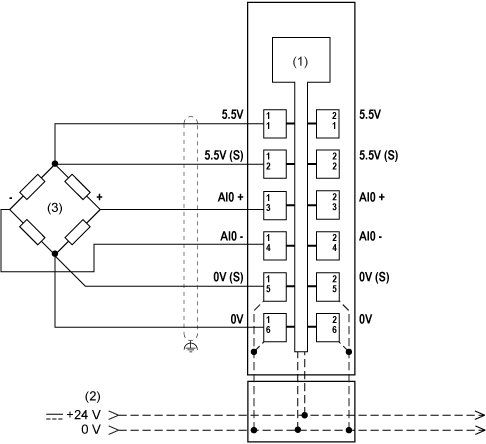
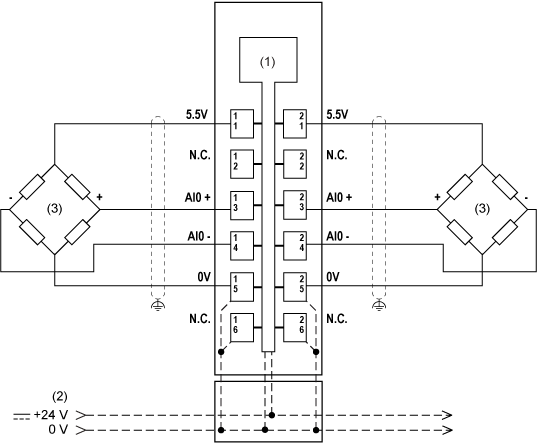

# Wiring Examples

## Six-Wire Full-Bridge Strain Gauge

Precision can be improved by using strain gauge cells with feedback of the bridge voltage.

The additional sensor lines with the strain gauge bridge supply compensate for the thermal resistance change of the feed lines.

If a 6-wire strain gauge cell is connected to the module, the sense lines are bypassed by the four internally linked strain gauge VCC connections (that is, strain gauge GND).

For this reason, the line compensation no longer functions. The measurement precision is therefore affected by changes in operating temperature.

Longer cable lengths and smaller cable cross-sections also increase the potential for detected errors in the measurement system.

In order to reduce cable resistance, the sense lines should be connected in parallel with the strain gauge bridge supply lines.

Optimal signal quality can be obtained by using a shielded twisted-pair cable.

The connections for the strain gauge supply lines, the sensor lines, and the bridge differential voltage lines should each use one twisted-pair cable.

**(1)** Internal electronics

**(2)** 24 Vdc I/O power segment integrated into the bus bases

**(3)** 6-wire full-bridge strain gauge

**(S)** Sensor

## Two Four-Wire Full-Bridge Strain Gauges

**(1)** Internal electronics

**(2)** 24 Vdc I/O power segment integrated into the bus bases

When connecting three or more full-bridge strain gauges in parallel, two lines must be connected together in a terminal block.

EIO0000002196.02