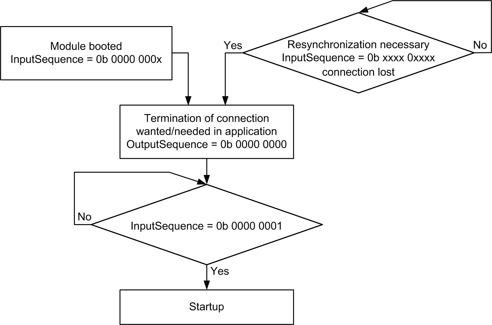
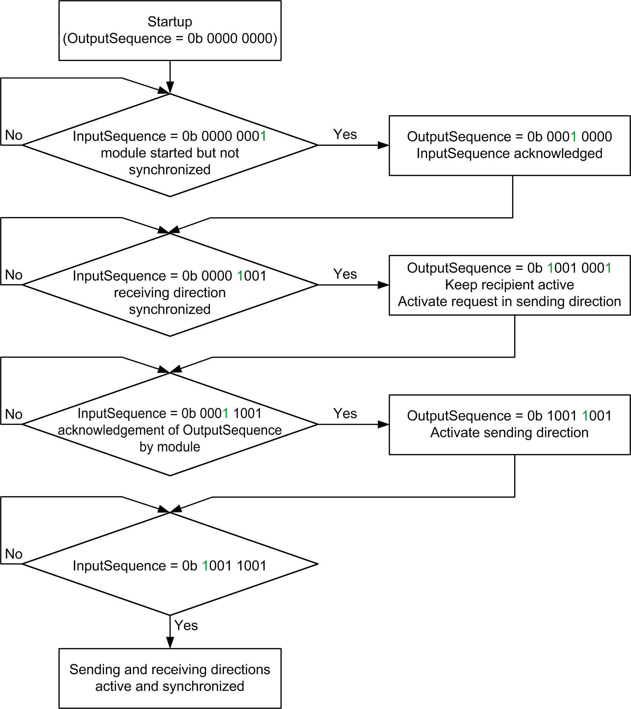

# Synchronization of Readiness to Send and Receive

## General

The start position is achieved when the first module starts up, when it has disconnected the connection, or when send/receive readiness has been terminated using the OutputSequence register. The module is reset to the default state. Depending on the program and the bus cycle times, it is possible that a value of 0 in the InputSequence is not read, as it is only present for a short time.

The following figure shows the synchronization procedure using the InputSequence and OutputSequence registers.

## General Information

The figure above shows the sending and receiving directions synchronized in one direction. Synchronization is also possible in the opposite direction.

If the receiving direction is activated, the module can begin transferring data using the MTU even if the sending direction has not yet been synchronized.

If transfer is only required in one direction, the unused transfer direction must not be activated.

Both transfer directions can be handled independently by the application.

EIO0000002196.02