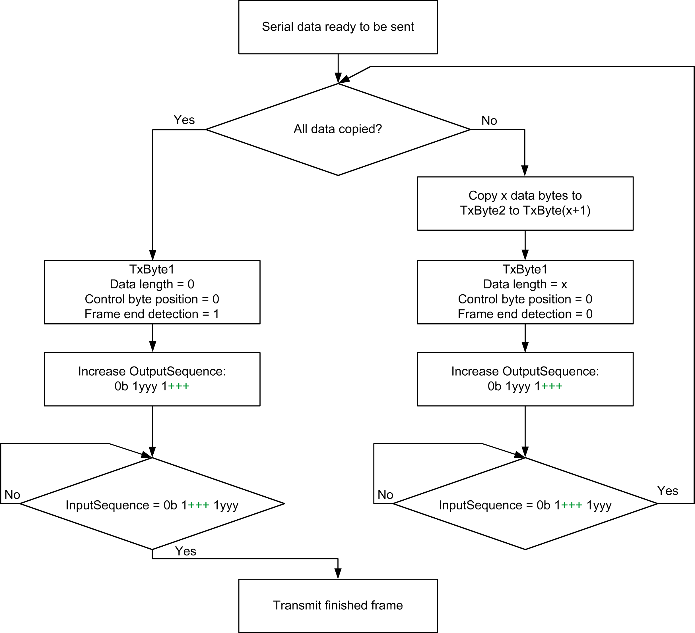
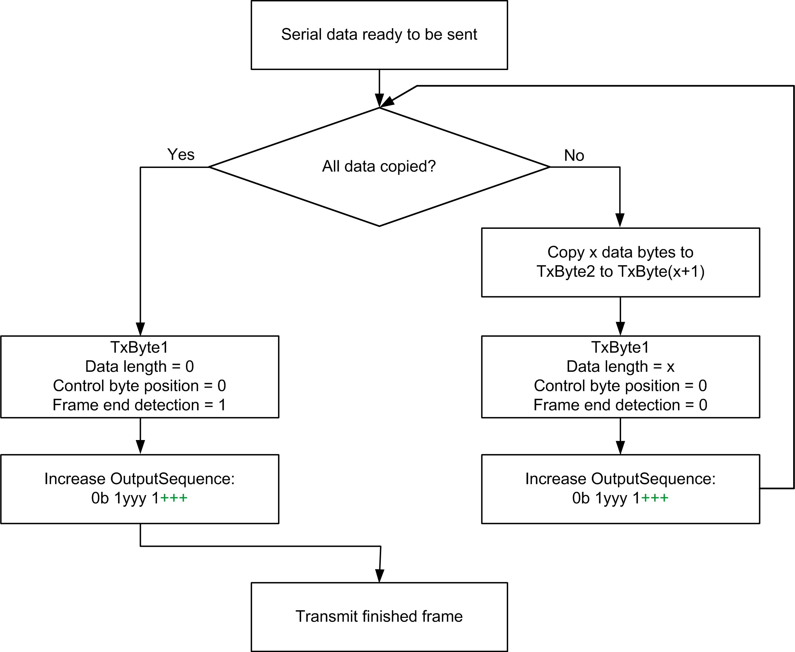
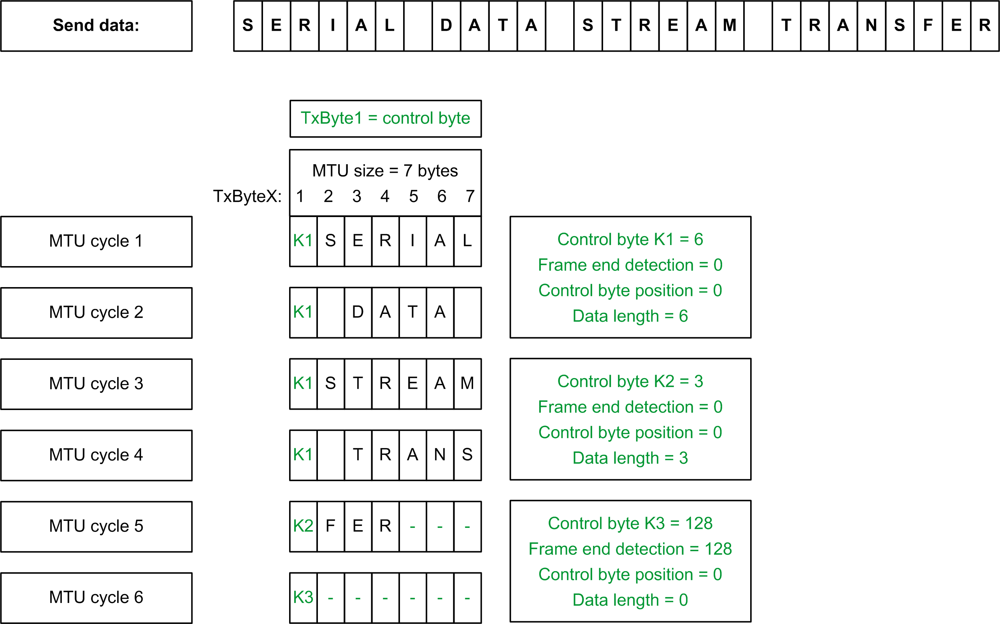

# Transmit Data: Preparing the Cyclic Data, Maximizing Control and Monitoring

## General

The following procedures for varying frame lengths demonstrate that no changes are required within the MTU when transferring in blocks with length specifications. The steps of the process and the position of the control bytes are identical; only the number of cycles required to complete the data transfer changes.

## Frame Length < Output MTU Size

If the frame length is at least one byte less than the Output MTU size, only one control byte is required and fits into the Output MTU.

| Step | Action |
| --- | --- |
| 1 | Copy the serial data into TxByte2 to TxByteX. |
| 2 | Create the control byte in TxByte1. Specify the length of data in the MTU and set frame end detection = 0. |
| 3 | Increase the sending sequence number in the OutputSequence. The module copies data to the transmission buffer during the next cycle. |
| 4 | Wait until the sending sequence number is acknowledged as confirmation of the data transfer in the InputSequence. |
| 5 | Create a control byte in TxByte1. Specify data length = 0 and set frame end detection = 1. |
| 6 | Increase the sending sequence number in the OutputSequence. The frame end is detected by the module and the frame is released for sending. |
| 7 | Wait until the sending sequence number acknowledgment appears as feedback in the Input-Sequence to confirm that the frame has been received.  A new frame can then be started. |

## Frame Length ≥ Output MTU Size

| Step | Action |
| --- | --- |
| 1 | Copy the first block of serial data into TxByte2 to TxByteX. |
| 2 | Create the control byte in TxByte1. Specify the length of data in the MTU and set frame end detection = 0. |
| 3 | Increase the sending sequence number in the OutputSequence. The module copies data to the transmission buffer during the next cycle. |
| 4 | Wait until the sending sequence number acknowledgment appears as confirmation of the data transfer in the InputSequence. |
| 5 | Repeat steps 1 to 4 until the serial data have been transferred in blocks. |
| 6 | Create the control byte in TxByte1. Set data length = 0 and frame end detection = 1. |
| 7 | Increase the sending sequence number in the OutputSequence. The frame end is detected by the module and the frame is released for sending. |
| 8 | Wait until the sending sequence number acknowledgment appears as feedback in the InputSequence, confirming that the frame has been transmitted.  A new frame can then be started. |

## Data Transmission Flow Chart: Preparation of the Cyclic Data, Maximum Control and Monitoring of the Individual Steps

## Data Transmission: Use of the Block Forward Mechanism

Data throughput can be increased considerably by using the Block Forward mechanism. The mandatory steps are the same. However, the next block is sent immediately in the next cycle, without waiting for acknowledgment of the previous block. The response time for each MTU block between writing to the module and reading the acknowledgment from the module is therefore removed. A maximum of seven unacknowledged MTU blocks can be issued in this way.

| Step | Action |
| --- | --- |
| 1 | Copy the first block of serial data into TxByte2 to TxByteX. |
| 2 | Create the control byte in TxByte1. Specify the data length in the MTU and set frame end detection = 0. |
| 3 | Increase the sending sequence number in the OutputSequence. The module copies data to the transmission buffer during the next cycle. |
| 4 | Repeat steps 1 to 3 until the serial data have been transferred in blocks. |
| 5 | Create the control byte in TxByte1. Specify data length = 0 and frame end detection = 1. |
| 6 | Increase the sending sequence number in the OutputSequence. The frame end is detected by the module and the frame is released for sending. |

## General Information

The cyclic acknowledgments of the transferred sending sequence number of the previous blocks in the InputSequence provide confirmation that these blocks have been received. If the sending sequence number remains unacknowledged, the procedure must be repeated, starting from the first unacknowledged sequence number.

To monitor throughput in the hardware system, it is necessary to determine the number of cycles between increasing the sending sequence number and receiving the acknowledgment. The number of cycles may vary considerably, depending on the relationship between task classes, network cycle times, and the topology of the available network.

## Data Transmission Flow Chart: Use of the Block Forward Mechanism

## Example: Partitioning Control Byte and Transmission Data

A 27 byte long frame is to be transferred. The MTU size is set to 7 bytes.

The process of preparing and splitting up the transmission data is the same, regardless of whether the Block Forward mechanism is used:

* Without use of the Block Forward mechanism after the MTU cycles for the transfer of the transmission data, it waits for acknowledgment of the sending sequence number.
* With use of the Block Forward mechanism, the subsequent data block is transferred immediately in the next cycle.

In both cases, a new frame can only be started after MTU cycle 6.

EIO0000002196.02