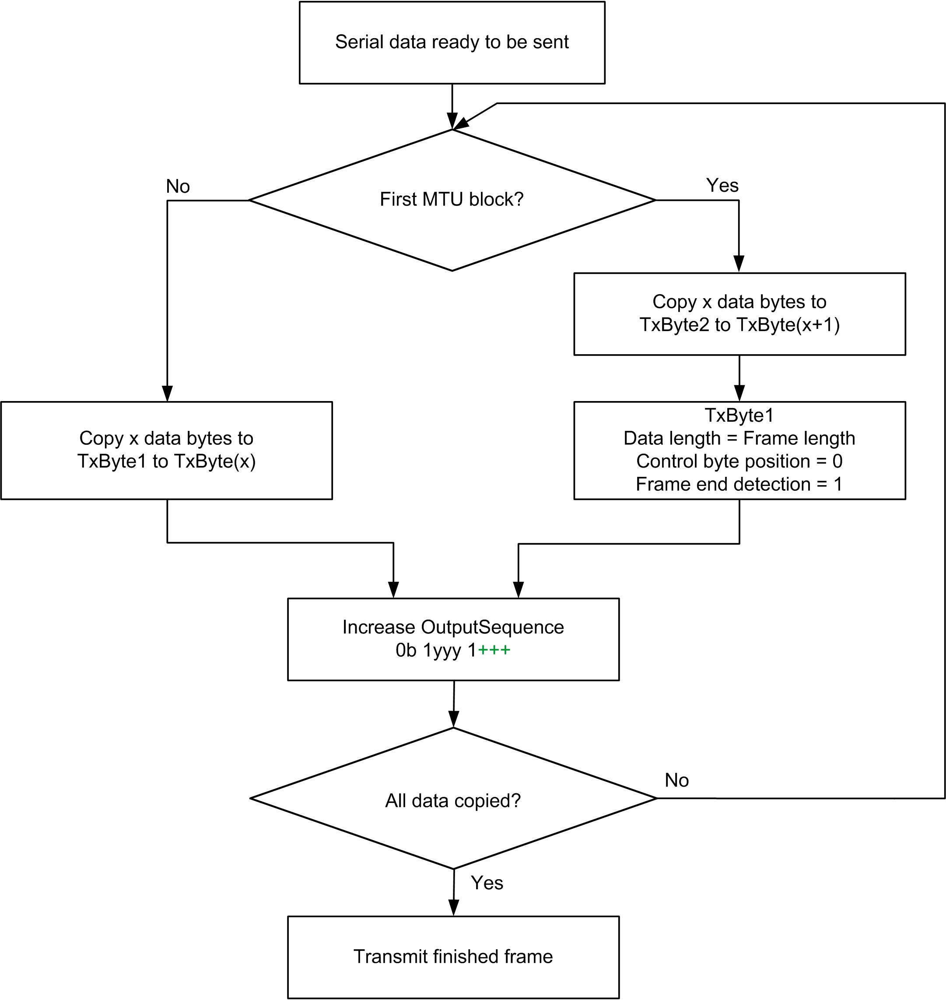
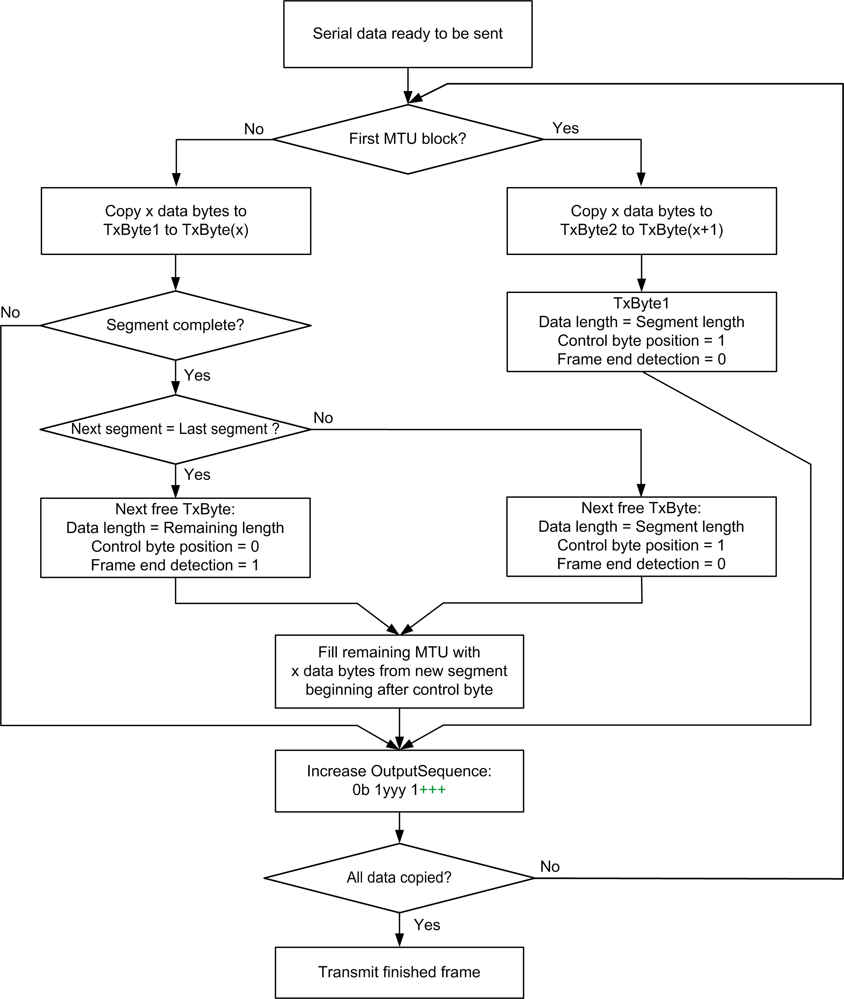
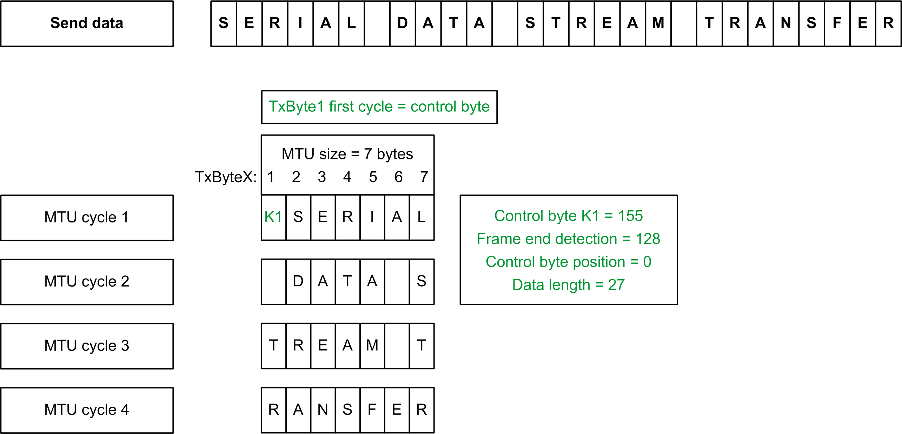
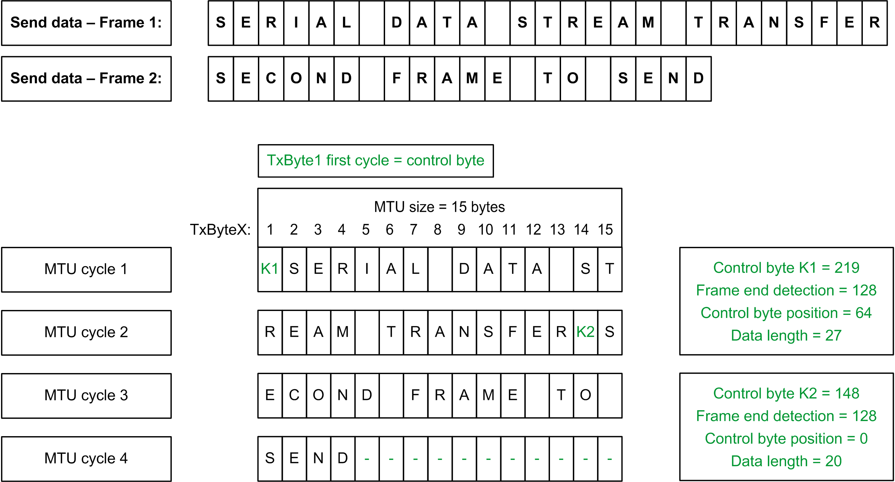

# Transmit Data: Preparing Cyclic Data, Maximizing Data Throughput, Frame Length ≤ Maximum Segment Size (63 Bytes)

## General

NOTE: From the second MTU block onwards, the serial data starts in TxByte1; there are no more control bytes.

| Step | Action |
| --- | --- |
| 1 | Copy the first block of serial data into TxByte2 to TxByteX. |
| 2 | Create the control byte in TxByte1. Specify the frame length and set frame end detection =1. |
| 3 | Increase the sending sequence number in the OutputSequence. The module copies data to the transmission buffer during the next cycle. |
| 4 | When using the Block Forward mechanism, repeat steps 1 to 3 until the serial data have been transferred in blocks. With the last block, the module detects that the end of the frame has been reached and releases the frame for sending. A new frame can be started immediately in the next cycle. |
| 5 | The cyclic acknowledgments of the transferred sending sequence number of blocks in the InputSequence confirm that these blocks have been received. If the sending sequence number remains unacknowledged, the procedure must be repeated starting from the first unacknowledged sequence number. |

## Data Transmission Flow Chart: Preparing Cyclic Data, Maximizing Data Throughput, Frame Length ≤ Maximum Segment Size

## Frame Length > Maximum Segment Size

NOTE: From the second MTU block onwards, the serial data starts in TxByte1; there are no more control bytes.

| Step | Action |
| --- | --- |
| 1 | Copy the first block of serial data into TxByte2 to TxByteX. |
| 2 | Create the control byte in TxByte1. Specify the segment length, control byte position = 1, and frame end detection = 0. |
| 3 | Increase the sending sequence number in the OutputSequence. The module copies data to the transmission buffer during the next cycle. |
| 4 | When using the Block Forward mechanism, repeat steps 1 to 3 until the data of the first segment have been transferred in blocks. |
| 5 | If unallocated TxBytes still exist in the first segment, with control byte position = 1 the next segment starts immediately in the first unallocated TxByte and the remaining bytes are filled with data. With control byte position = 0, the next segment starts in the next new MTU. |
| 6 | Repeat steps 1 to 5 to transfer the frame segments in blocks. In the control byte of the last segment, set frame end detection = 1. With the last block of the last segment, the module detects that the frame length has been reached and releases the frame to be sent. A new frame can be started immediately in the next cycle. |
| 7 | Cyclic acknowledgment of the transferred sending sequence numbers of the previous blocks/segments in the InputSequence confirms that the blocks have been received. If the sending sequence number remains unacknowledged, the procedure must be repeated starting from the first unacknowledged sequence number. |

## Example: Partitioning Control Byte and Transmission Data

A frame with 27 bytes is to be transferred. The MTU size is configured to 7 bytes.

In contrast to the figure in [Transmit Data: Preparation of the Cyclic Data, Maximum Organization, and Monitoring of the Individual Steps](D-SE-0069287.html#D-SE-0069287__D-SE-0069287.3)), this results in a saving of two MTU cycles for the same frame length and MTU size. A new frame can be started after the last MTU cycle 4.

When preparing or splitting up the transmission data, it makes no difference whether the Block Forward mechanism is used:

* Without use of the Block Forward mechanism after the individual MTU cycles for the transfer of the transmission data, the module waits for acknowledgment of the sending sequence number.
* With use of the Block Forward mechanism, the next data block is transferred immediately in the next cycle.

## Further Optimization

To use available space in the last MTU block of the frame for the next frame, set the control byte position = 1 identifier in the last control byte of the frame. The first unallocated TxByte in the last MTU block is then used as the control byte for the next frame. The MTU is then filled with the serial data of the new frame until the end of the data. The serial data in the next cycle starts in TxByte1.

## Example Partitioning Control Byte and Transmission Data

Two frames with 27 bytes and 20 bytes are to be transferred. The MTU size is set to 15 bytes.

EIO0000002196.02