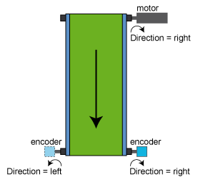

# Direction

Direction

General

|  |  |
| --- | --- |
| Type | AD |
| Devices supporting the parameter | SinCos Encoder Input,  Incremental Encoder Input,  Encoder network (Synchronization encoder output, Synchronization encoder input) |
| Traceable | Yes |

Functional Description

Defines the direction of rotation.

The direction of rotation is taken into consideration in the parameter [Velocity](EncoderOutput-13.htm#XREF_D_SE_0069682_1). A negative direction of rotation causes the absolute position to be reflected within its range of representation.

NOTE: Modify the Direction parameter value at encoder standstill. Otherwise, the [velocity signal](EncoderOutput-13.htm#XREF_D_SE_0069682_1) appears incorrect, which can cause the detection of other errors. Maintain the standstill for at least the set filter time.

| Value | Data type | Meaning |
| --- | --- | --- |
| left / 0 | BOOL | Rotation in counterclockwise direction (looking at the shaft). |
| right / 1 | BOOL | Rotation in clockwise direction (looking at the shaft). |

Parameter Direction using the example of the conveyor belt

EIO0000002708.01

© 2018 Schneider Electric. All rights reserved.