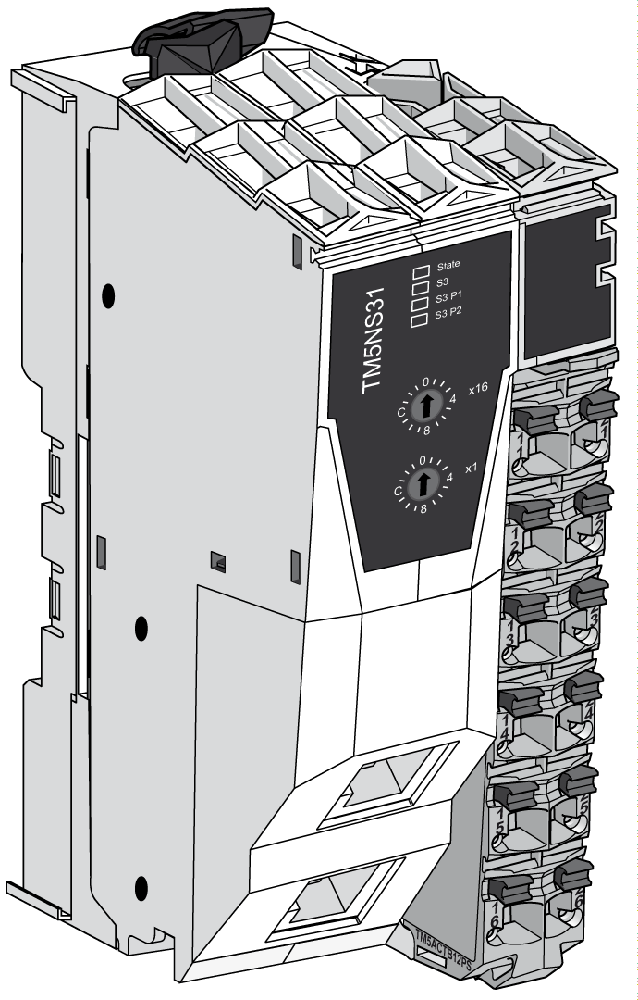

# General Description

## Introduction

The TM5 fieldbus interface with built-in power distribution is the first element of the [TM5 distributed I/O island](../../../../../api/crossBook?lang=en-US&virtualBookName=m258pig&topicID=D_SE_0009280). When assembled, the TM5 fieldbus interface is composed of four elements:

* Fieldbus interface bus base
* Fieldbus interface module
* Interface Power Distribution Module (IPDM)
* Terminal block

The following figure shows a TM5 fieldbus interface when assembled:

## TM5 Fieldbus Interface Features

The table below provides the bus base reference:

| Reference | Description |
| --- | --- |
| [TM5ACBN1](../../../../../api/crossBook?lang=en-US&virtualBookName=m258pig&topicID=D_SE_0009228) | Bus base for fieldbus interface module and Interface Power Distribution Module (IPDM) |

The table below provides the fieldbus interface module references:

| Reference | Description |
| --- | --- |
| [TM5NS31](D-SE-0042134.html#D-SE-0042134) | SERCOS III interface module |

The table below provides the Interface Power Distribution Module (IPDM) reference:

| Reference | Description |
| --- | --- |
| [TM5SPS3](D-SE-0009141.html#D-SE-0009141) | Fieldbus interface 24 Vdc power supply |

The table below provides the terminal block reference:

| Reference | Description |
| --- | --- |
| [TM5ACTB12PS](../../../../../api/crossBook?lang=en-US&virtualBookName=m258pig&topicID=D_SE_0004137) | 24 Vdc, 12-pin terminal block for PDM, IPDM and receiver electronic module |

EIO0000003221.02