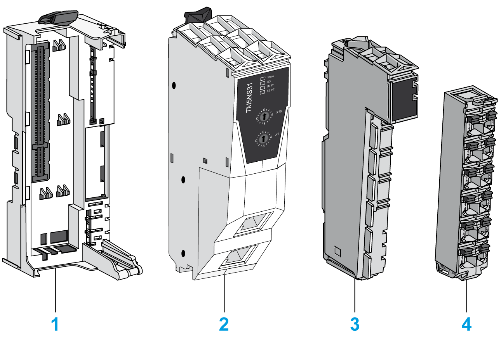

# Physical Description

## Introduction

Each fieldbus interface consists of four elements. These elements are the:

* Fieldbus interface bus base
* Fieldbus interface module
* Interface Power Distribution Module (IPDM)
* Terminal block

## Elements

The following figure shows the different parts that compose the TM5 fieldbus interface:

**(1)** Fieldbus interface bus base

**(2)** Fieldbus interface module

**(3)** Interface Power Distribution Module (IPDM)

**(4)** Terminal block

When assembled the four elements form an integral unit that resists vibration and electrostatic discharge.

| NOTICE | |
| --- | --- |
|  | ELECTROSTATIC DISCHARGE  * Do not touch the pin connectors of the block. * Keep the cables or sealing plugs in place during normal operation.  Failure to follow these instructions can result in equipment damage. |

## Dimensions

The following figure shows the dimensions of the TM5 fieldbus interface:

## Accessories

Refer to the [Installation of Accessories](../../../../../api/crossBook?lang=en-US&virtualBookName=m258pig&topicID=D_SE_0001024).

## Labeling

Refer to the [Labeling the TM5 System](../../../../../api/crossBook?lang=en-US&virtualBookName=m258pig&topicID=D_SE_0001023).

EIO0000003221.02