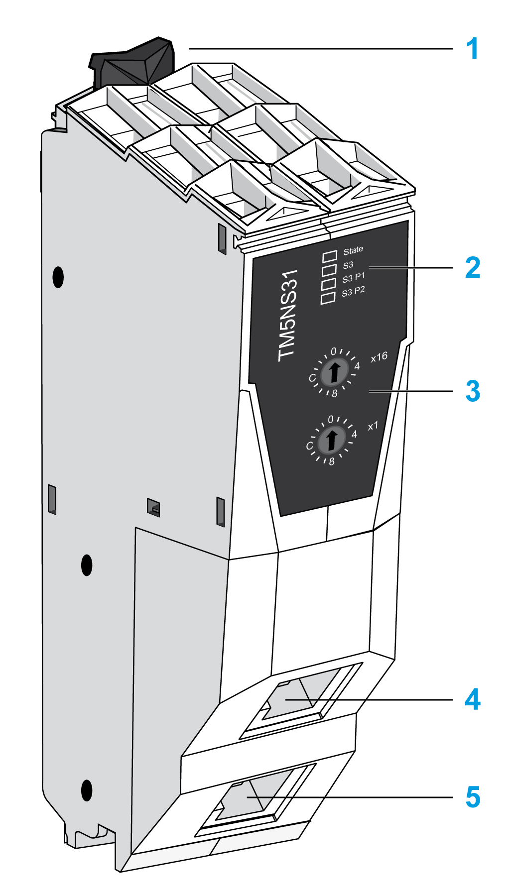

# TM5NS31 Presentation

## Main Characteristics

This table describes the main characteristics of the TM5NS31 Sercos interface module:

| Characteristic | Description |
| --- | --- |
| Standard | Sercos III |
| Connector type | RJ45 |

## Presentation

The following figure shows the TM5NS31:

**1** Locking clip

**2** Status LEDs

**3** Sercos III address setting rotary switches

**4** Sercos III Port 1 connector (RJ45)

**5** Sercos III Port 2 connector (RJ45)

## Status LEDs

The following LEDs are provided:

* **State**
* **S3**
* **S3 P1 (Port 1)**
* **S3 P2 (Port 2)**

The **State** LED is a green / red dual LED. The color green (status) is superimposed on the color red (detected error).

This table describes the **State** LEDs:

| Color | State | Description |
| --- | --- | --- |
| - | Off | No power applied. |
| Green | On | No error is detected, bus interface is initialized and ready for operation. |
| Green | Flashing  (12.5 Hz) | Initialization phase (booting of the I/O modules or setting up the I/O functional groups). |
| Green | Flashing  (4 Hz) | Minor error detected, such as missing I/O module (is reset when the correction is made). |
| Green | Flashing  (0.66 Hz) | New or changed configuration data (I/O modules or bus interface) have been received but not yet stored in the flash memory. |
| Red | Flashing  (8 Hz) | Major error detected (for example lack of resources, error detected in the firmware data flow). |

NOTE: After applying power to the bus interface, the LED will flash red several times intermittently. These signals are not error indications.

This table describes the **S3** LEDs:

| Color | State | Description | Instructions |
| --- | --- | --- | --- |
| - | Off | No power applied or there is no communication due to an interrupted or separated connection. | Sercos III boot-up or hot swap. |
| Green | On | Active Sercos III connection without an error detected in the CP4 (Communication Phase 4). | n.a. |
| Flashing  (4 Hz, 125 ms) | The device is in loopback mode. Loopback describes the situation in which the Sercos III telegrams have to be sent back on the same port on which they were received.  Possible causes:   * Line topology * Sercos III ring break | Close the ring. |
| Red | On | Sercos III diagnostic class 1 (DK1) error has been detected on port 1 and/or 2. Sercos III communication is no longer possible on the ports (for example due to encoder error detection). | Reset condition   * Clear the device errors * Acknowledge the error in the menu * Switch from CP2 to CP3 alternatively.  NOTE: Diagnostic messages pending in the system are not acknowledged by these actions. |
| Red / green | Flashing  (4 Hz, 125 ms) | Communication error detected.  Possible causes:   * Improper functioning of the telegram * CRC (Cyclic Redundancy Check) error detected | Reset condition   * The controller configuration displays the error * Acknowledge the error. * Switch from CP2 to CP3 alternatively.  NOTE: Diagnostic messages pending in the system are not acknowledged by these actions. |
| Orange | On | The device is in a communication phase CP0 up to and including CP3 or HP0 (Hot Swap Phase) up to and including HP2. Sercos III telegrams are received. | n.a. |
| Orange | Flashing  (4 Hz, 125 ms) | Device identification | Triggered by means of the parameter `IdentifyDevice` or the DriveAssistant tool. |

This table describes the **S3 P1** and **S3 P2** LEDs:

| Color | State | Description |
| --- | --- | --- |
| Off | Off | No cable connected. |
| Green | Flashing | Active Sercos III or Ethernet communication. |
| Green | On | Link, but no telegrams / communication (for example controller is booting). |

EIO0000003221.02