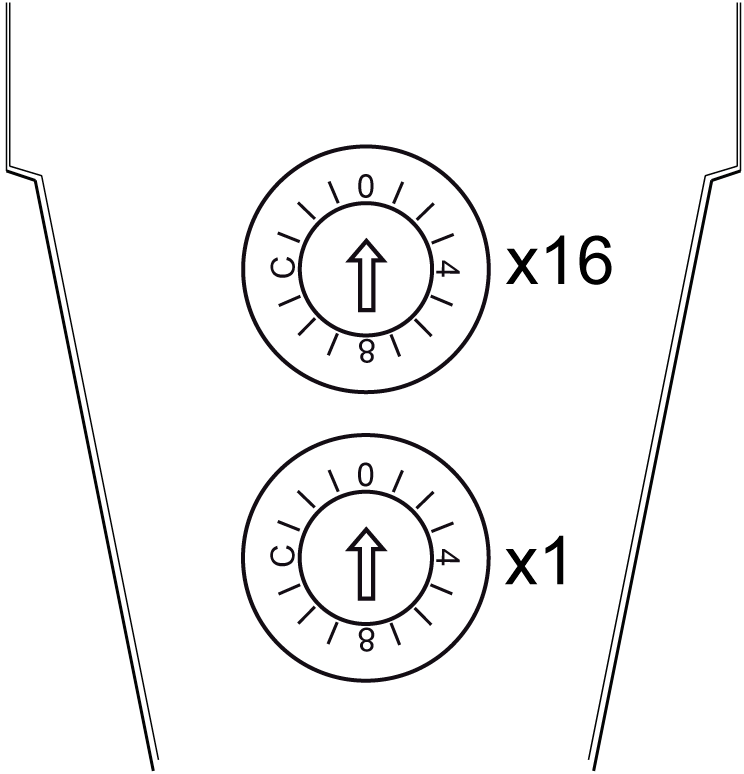
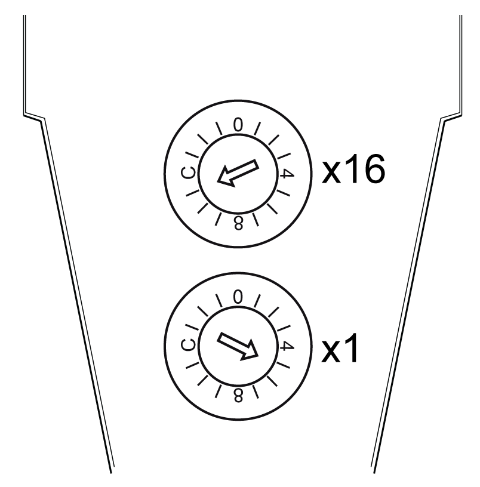

# Setting the Sercos III Address

## Sercos III Module Address

The Sercos III address of the TM5NS31 module is set by using two rotary switches. The address is preset to 0 by default. This way, an automatic addressing is triggered.

NOTE: Only addresses from 1 to 239 are permitted.

The Sercos III address at the rotary switches is in hexadecimal notation.

The following figure shows the rotary switches:

This table describes the addresses for Sercos III:

| Addresses | Description |
| --- | --- |
| 0 dec (0 hex) | Auto-addressing (not a valid address); address assigned by controller   * For PacDrive LMC controllers, the setting 0 is recognized when the value `SerialNumberController` or `TopologyAddress` or `ApplicationType` is selected for the parameter `IdentificationMode`(1). * For Modicon TM262M• controllers, the setting 0 is recognized, when the value `Topology mode` is selected for the parameter `IdentificationMode`(1). |
| 1-255 dec (1-FF hex)(1) | Manual addressing   * For PacDrive LMC controllers, this setting is recognized when the value `SercosAddress` is selected for the parameter `IdentificationMode`(1). * For Modicon TM262M• controllers, the setting is recognized when the value `Sercos mode` is selected for the parameter `IdentificationMode`(1). |
| **(1)** `IdentificationMode` is a parameter in EcoStruxure Machine Expert. | |

## Sercos III Address Setting Example

The following figure shows an example when the Sercos III address is configured to 181 (decimal):

**(x16)** High-order rotary switch: set to B (Hex) = 11 (decimal)

**(x1)** Low-order rotary switch: set to 5 (Hex) = 5 (decimal)

Sercos III address = 11x16 + 1x5 = 181

EIO0000003221.02