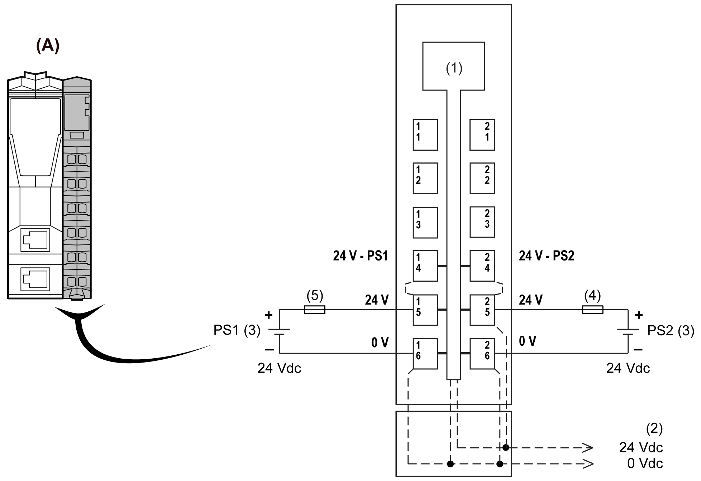

# TM5SPS3 Wiring Diagram

## Wiring Diagram

The following figure shows the wiring diagram for the TM5SPS3 interface power distribution module:

**(A)** Interface Power Distribution Module (IPDM)

**(1)** Internal electronics

**(2)** 24 Vdc I/O power segment integrated in the bus bases

**(3)** PS1/PS2: External isolated power supply 24 Vdc

**(4)** External fuse, Type T slow blow, 10 A maximum, 250 V

**(5)** External fuse, Type T slow blow, 1 A, 250 V

| WARNING | |
| --- | --- |
|  | POTENTIAL OF OVERHEATING AND FIRE  * Do not connect the modules directly to line voltage. * Use only isolating PELV systems according to IEC 61140 to supply power to the modules.  Failure to follow these instructions can result in death, serious injury, or equipment damage. |

| WARNING | |
| --- | --- |
|  | UNINTENDED EQUIPMENT OPERATION  Do not connect wires to unused terminals and/or terminals indicated as “No Connection (N.C.)”.  Failure to follow these instructions can result in death, serious injury, or equipment damage. |

EIO0000003221.02