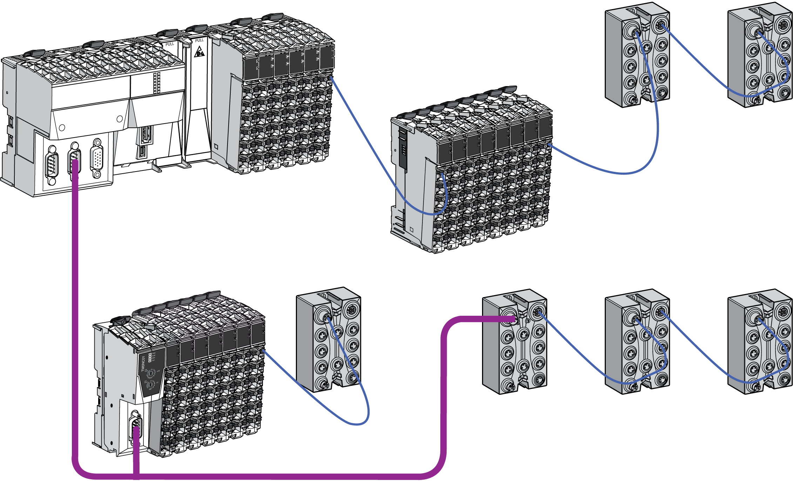

# Introduction

Introduction

The TM5 / TM7 System is a flexible control system. The following graphic depicts a typical architecture with an LMC058 motion controller:

The flexibility is obtained by the association of:

oTM5 System

o[Controller](../glossary/glossary.htm#XREF_D_SE_0024697_661)

oTransmitter / Receiver modules

oField bus interface module

oCompact I/O

oSlices

oAccessories

oTM7 System

oTM7 Field bus interface I/O blocks

oBlocks

oAccessories

The controller with embedded I/Os and networking is the main component of the TM5 / TM7 System. It can be expanded by compact I/O, slices and/or blocks.

An expansion module is a compact I/O or a slice in this documentation.

The compact I/O is used to expand and adjust the number of I/O in the TM5 System to the exact needs of your [application](../glossary/glossary.htm#XREF_D_SE_0024697_626).

A slice has one of the following functions in the TM5 System:

oExpansion I/Os or

oPower distribution or

oCommon distribution or

o[Expansion bus](../glossary/glossary.htm#XREF_D_SE_0024697_695)

A block has one of the following functions in the TM7 System:

oExpansion I/Os or

oPower distribution

The expansion modules and blocks are used:

oto expand and adjust the number of I/O in a TM5 / TM7 System to the exact needs of your application.

oto manage the distribution of power for electronic modules and I/O (for example separation of 24 Vdc inputs from 24 Vdc outputs...)

Application requirements determine the architecture of your TM5 / TM7 System.

Depending on your needs, the local configuration architecture may optionally be expanded to include remote expansion I/Os and/or distributed I/O systems.

Remote I/O expansions are made by extending the internal TM5 data bus through the use of TM5 Transmitters and Receivers.

Distributed I/O expansions are made through the use of industrial networks (such as [CANopen](../glossary/glossary.htm#XREF_D_SE_0024697_650), [Ethernet](../glossary/glossary.htm#XREF_D_SE_0024697_693),...). These networks can be created using the integrated communication ports on the [controller](../glossary/glossary.htm#XREF_D_SE_0024697_806) or the optional TM5 PCI modules.