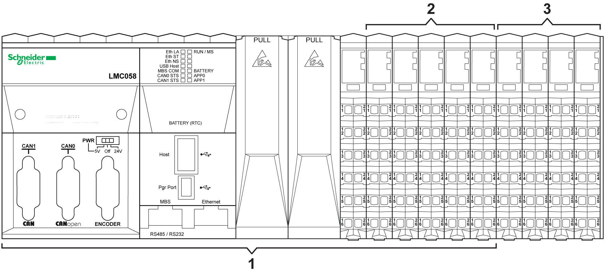

# Local Configuration Architecture

Local Configuration Architecture

The local configuration architecture is composed of the controller and its embedded power distribution and I/O modules, as well as any installed PCI and local [expansion I/O modules](../glossary/glossary.htm#XREF_D_SE_0024697_698).

NOTE: A local configuration is only possible with the TM5 system.

The following figure represents a controller with expansion I/Os on a local TM5 bus:

1   Controller

2   Embedded I/Os

3   Local expansion I/Os

NOTE: Embedded I/Os cannot be separated from the controller.