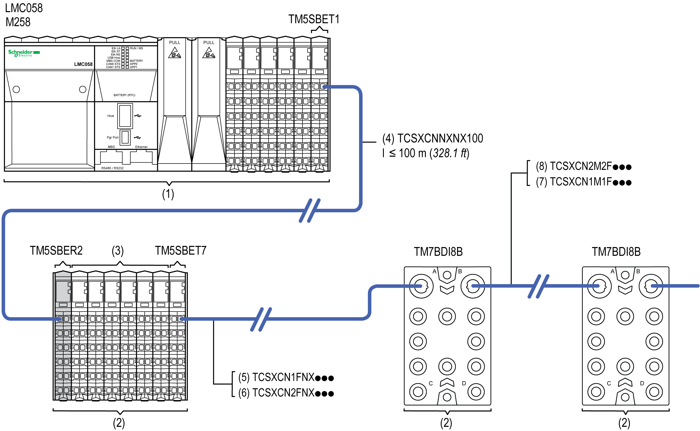

# Remote Configuration Architecture

Remote Configuration Architecture

In addition to your local configuration you can place remote I/Os at a distance up to 100 m (328.1 ft) from the controller.

NOTE: You can create remote I/Os with TM5 expansion modules and/or TM7 expansion blocks.

Refer to [Modicon TM5 Transmitter and Receiver Modules Hardware Guide](../../../../../../api/crossBook?lang=en-US&virtualBookName=tm5bushw&topicID=D_SE_0003232_9) to design remote configurations.

The following figure represents a global TM5 / TM7 System architecture including a controller with expansion I/Os and remote I/Os:

1   Local configuration

2   Remote configuration

3   Remote expansion I/Os

4   TM5 Expansion bus cable

5   TM7 expansion bus IN attachment cable straight

6   TM7 expansion bus IN attachment cable elbowed

7   TM7 expansion bus drop cable straight

8   TM7 expansion bus drop cable elbowed

TM5SBET1 & TM5SBET7   Transmitter modules

TM5SBER2   Receiver module