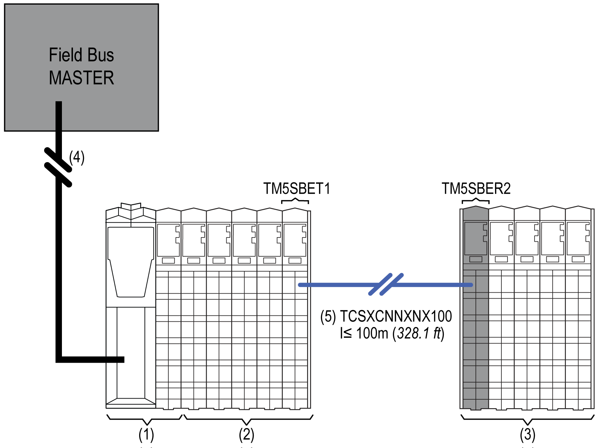

# TM5 Distributed I/Os

TM5 Distributed I/Os

The following figure represents TM5 distributed I/Os connected to a field bus master:

1   TM5 field bus interface

2   TM5 distributed expansion I/Os

1 + 2   TM5 distributed I/O island

3   TM5 remote I/O island

4   Field bus cable

5   TM5 expansion bus cable