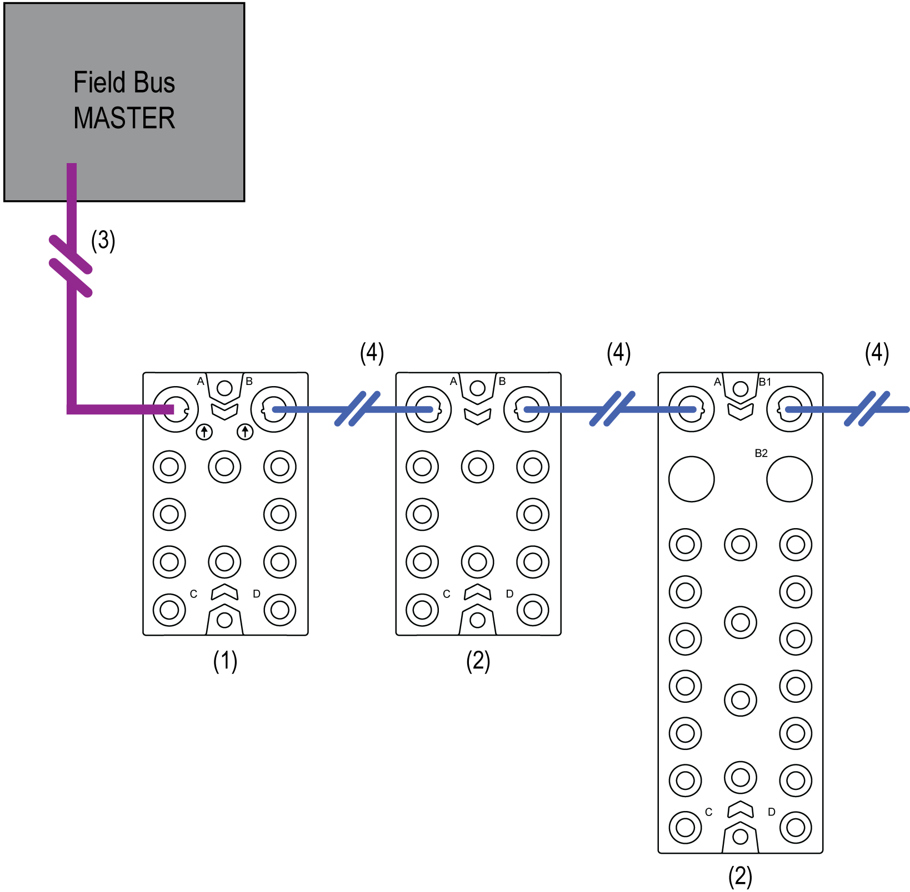

# TM7 Distributed I/Os

TM7 Distributed I/Os

The following figure represents TM7 distributed I/Os connected to a field bus master:

1   TM7 field bus interface I/O block

2   TM7 expansion I/O blocks

3   Field bus cable

4   TM7 expansion bus cables