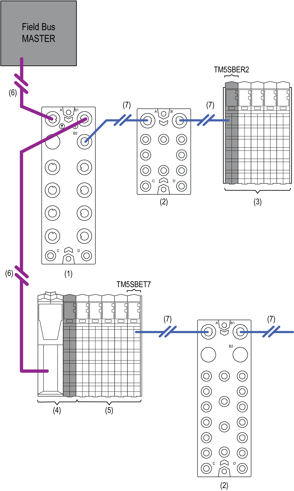

# TM5/TM7 Mixed Distributed I/Os

TM5/TM7 Mixed Distributed I/Os

In addition to your distributed configuration you can place remote I/Os at a distance up to 100 m (328.1 ft) and create a TM5 / TM7 mixed distributed I/Os [configuration](../glossary/glossary.htm#XREF_D_SE_0024697_659).

The following figure represents a global TM5 / TM7 System architecture including TM5 / TM7 mixed distributed I/Os:

1   TM7 field bus interface I/O block

2   TM7 expansion I/O blocks

3   TM5 remote I/O island

4   TM5 field bus interface

5   TM5 distributed expansion I/Os

4 + 5   TM5 distributed I/O island

6   Field bus cables

7   TM7 Expansion bus cables