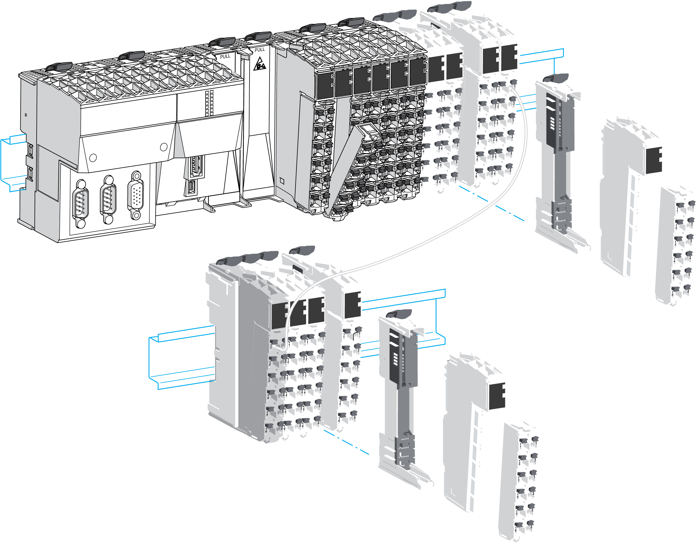

# Introduction

Introduction

The [controller](../glossary/glossary.htm#XREF_D_SE_0024697_661) is the main [element](../glossary/glossary.htm#XREF_D_SE_0024697_725) of the TM5 System.

The families of controllers are:

oModicon M258 Logic Controller

oModicon LMC058 Motion Controller

The following graphic depicts a typical TM5 System with the LMC058 motion controller:

